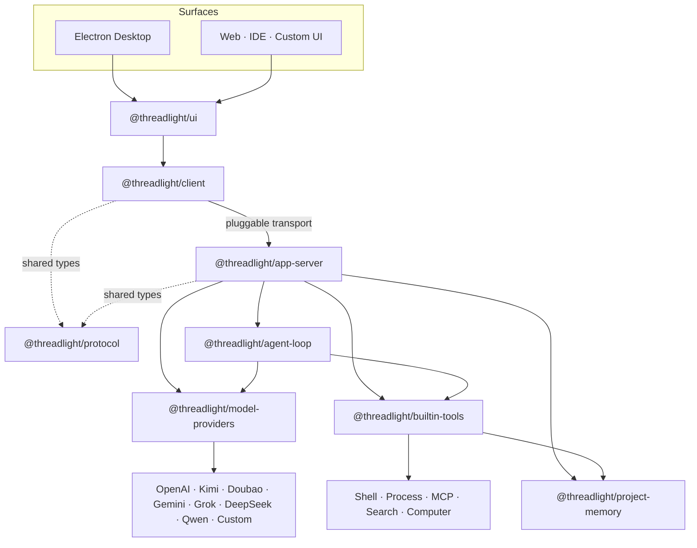

<div align="center">
  

  <h1>Threadlight</h1>

  <p><strong>See every step your local agent takes.</strong></p>
  <p>
    An open-source agent runtime and desktop client built for real engineering work.<br />
    Model reasoning, tool calls, terminals, code review, project memory, and Computer Use<br />
    become one observable, recoverable, and extensible execution trail.
  </p>

  <p>
    <a href="./README.md">简体中文</a>
    ·
    <a href="./README.en.md">English</a>
    ·
    <a href="./docs/DEVELOPMENT.md">Development guide</a>
  </p>

  <p>
    
    <a href="https://github.com/nagisa77/threadlight/releases/latest"></a>
    <a href="https://github.com/nagisa77/threadlight/actions/workflows/ci.yml"></a>
    
    
    
    
  </p>
</div>

<br />

<p align="center">
  
</p>

<p align="center">
  <sub>Reasoning, tool execution, file changes, and diff review—inside one workspace.</sub>
</p>

---

Threadlight is more than a chat interface, and an agent is more than a single model request.

Real tasks span multiple model calls, streaming output, tool execution, background processes, file changes, and interrupted runs. Threadlight makes that entire process visible while preserving opaque model state across tool turns, so reasoning continuity and call linkage survive every action.

> [!IMPORTANT]
> Threadlight is currently **Alpha** software for local development, architecture exploration, and agent application prototyping. Built-in tools run with the current user's permissions and do not provide an OS-level sandbox. Use trusted workspaces only.

## Why Threadlight

| | Capability | How Threadlight approaches it |
| --- | --- | --- |
| **01** | **Observable execution** | Threads, turns, model deltas, tool calls, command output, file changes, and token usage are exposed as structured events. |
| **02** | **Designed for local projects** | Projects, tasks, attachments, terminals, reviews, and long-term memory are organized around a workspace—not a remote application database. |
| **03** | **Provider-neutral core** | The loop does not depend on vendor SDKs. OpenAI Responses, DeepSeek, and Qwen-compatible protocols live in separate adapters. |
| **04** | **Continuous, recoverable state** | Opaque model state survives tool turns. Tasks can persist, resume, and stop, with size limits and redaction applied before disk writes. |
| **05** | **Clear architectural boundaries** | The agent loop, provider adapters, app server, protocol, client, and UI remain independently reusable and extensible. |
| **06** | **Offline verification** | New behavior is tested with scripted model providers, reproducing multi-step tool flows without real APIs or network access. |

## A desktop workspace, not just a chat box

### Review the work where it happens

Execution history and final responses stay in the main conversation. The right panel can open the workspace tree, source files, conversation changes, and diffs side by side. The bottom panel can host multiple terminal or file tabs. New tasks in Git projects run in isolated worktrees by default, while non-Git projects write directly to the selected folder. Project runtimes are reused inside the worktree, while persistent Git-ignored local data stays isolated and can be explicitly applied to the original workspace from the Diff panel without entering a Git commit or PR. The Diff panel can restore one file or all task changes after checking for newer workspace conflicts. The sidebar supports search, lifecycle filters, rename, pinning, and archiving, with permanent deletion available only for archived tasks. Context no longer has to bounce between a chat app, editor, and terminal.

### Keep project knowledge with the project

<p align="center">
  
</p>

Long-term knowledge lives in a readable, versionable `.threadlight/MEMORY.md`. Every new task receives a snapshot of the current context. Agents update it through a provider-neutral tool with revision checks, preventing silent concurrent overwrites.

### Configure models and experience in one place

<p align="center">
  
</p>

The desktop client supports:

- OpenAI, Kimi, Doubao, Gemini, Grok, DeepSeek, Alibaba Cloud Model Studio / Qwen, and custom OpenAI-compatible services.
- Default model selection for different workloads.
- Simplified Chinese, Traditional Chinese, English, Japanese, and Korean.
- System, light, and dark themes.
- OS-backed secure API key storage, keeping secrets out of projects and logs.

### More built-in workflow

- Streamed answers, progress updates, tool activity, and command output.
- Drag-and-drop images and files, attachment previews, and voice transcription.
- Session-scoped background process status, incremental reads, waits, and termination.
- Temporary MCP runtimes for stdio or Streamable HTTP servers.
- macOS Computer Use with app/window/display sharing and picture-in-picture agent vision.
- Keyboard shortcuts, resizable panels, multi-tab terminals, and file views.

## Architecture



Four boundaries shape the project:

1. **The loop knows no vendor protocol.** `agent-loop` depends only on `ModelProvider`; wire formats, attachment uploads, and opaque-state conversion remain in adapters.
2. **The server does not leak into execution.** `app-server` owns JSON-RPC, task lifecycles, persistence, and transports without pushing those concerns into the loop.
3. **Client and server share only the protocol.** Both align through `@threadlight/protocol` without implementation-level coupling.
4. **Tools are capability boundaries.** Commands, processes, MCP, search, project memory, and Computer Use implement a common `Tool` interface and can be composed per environment.

## Quick start

### Requirements

- Node.js 22 or newer
- npm
- macOS screen recording and accessibility permissions for full Computer Use

```bash
git clone https://github.com/nagisa77/threadlight.git
cd threadlight
npm install
npm test
```

### Run the desktop client

The recommended path is to configure providers, models, and search keys in the desktop settings:

```bash
npm run desktop:dev
```

Configuration can also be injected through the environment:

```bash
export OPENAI_API_KEY="your-key"

# Optional: enable web_search
export BRAVE_SEARCH_API_KEY="your-key"

npm run desktop:dev
```

Build and preview the production bundle:

```bash
npm run desktop:preview
```

Create a standalone `.app` for the current Mac architecture:

```bash
npm run desktop:package
```

| Provider | Required | Optional |
| --- | --- | --- |
| OpenAI | `OPENAI_API_KEY` | `THREADLIGHT_MODEL` |
| DeepSeek | `THREADLIGHT_PROVIDER=deepseek`, `DEEPSEEK_API_KEY` | `THREADLIGHT_MODEL` |
| Kimi | `THREADLIGHT_PROVIDER=kimi`, `MOONSHOT_API_KEY` | `MOONSHOT_BASE_URL`, `THREADLIGHT_MODEL` |
| Doubao | `THREADLIGHT_PROVIDER=doubao`, `ARK_API_KEY` | `ARK_BASE_URL`, `THREADLIGHT_MODEL` |
| Gemini | `THREADLIGHT_PROVIDER=gemini`, `GEMINI_API_KEY` | `GEMINI_BASE_URL`, `THREADLIGHT_MODEL` |
| Grok | `THREADLIGHT_PROVIDER=grok`, `XAI_API_KEY` | `XAI_BASE_URL`, `THREADLIGHT_MODEL` |
| Custom compatible service | `THREADLIGHT_PROVIDER=custom`, `CUSTOM_BASE_URL`, `THREADLIGHT_MODEL` | `CUSTOM_API_KEY` |
| Qwen | `THREADLIGHT_PROVIDER=qwen`, `DASHSCOPE_API_KEY` | `DASHSCOPE_BASE_URL`, `THREADLIGHT_MODEL` |

```bash
# DeepSeek
export THREADLIGHT_PROVIDER="deepseek"
export DEEPSEEK_API_KEY="your-key"
export THREADLIGHT_MODEL="deepseek-v4-pro"

# Or Kimi (Kimi K3 by default)
export THREADLIGHT_PROVIDER="kimi"
export MOONSHOT_API_KEY="your-key"
export MOONSHOT_BASE_URL="https://api.moonshot.ai/v1"
export THREADLIGHT_MODEL="kimi-k3"

# Or Doubao through Volcengine Ark
export THREADLIGHT_PROVIDER="doubao"
export ARK_API_KEY="your-key"
export ARK_BASE_URL="https://ark.cn-beijing.volces.com/api/v3"
export THREADLIGHT_MODEL="doubao-seed-2-0-pro-260215"

# Or Gemini
export THREADLIGHT_PROVIDER="gemini"
export GEMINI_API_KEY="your-key"
export GEMINI_BASE_URL="https://generativelanguage.googleapis.com/v1beta/openai"
export THREADLIGHT_MODEL="gemini-3.6-flash"

# Or Grok
export THREADLIGHT_PROVIDER="grok"
export XAI_API_KEY="your-key"
export XAI_BASE_URL="https://api.x.ai/v1"
export THREADLIGHT_MODEL="grok-4.5"

# Or a custom OpenAI-compatible service (API key is optional)
export THREADLIGHT_PROVIDER="custom"
export CUSTOM_BASE_URL="http://127.0.0.1:11434/v1"
export THREADLIGHT_MODEL="llama3.2"

# Or Alibaba Cloud Model Studio / Qwen
export THREADLIGHT_PROVIDER="qwen"
export DASHSCOPE_API_KEY="your-key"
export DASHSCOPE_BASE_URL="https://dashscope.aliyuncs.com/compatible-mode/v1"
export THREADLIGHT_MODEL="qwen3.7-plus"
```

The Electron renderer remains a browser environment with Node integration disabled. Preload exposes only a limited Threadlight bridge, while app-server runs as a separate child process.

## Use it as a runtime

### Agent Loop

```ts
import { AgentLoop, defineAgent } from "@threadlight/agent-loop";
import { createExecCommandTool } from "@threadlight/builtin-tools";
import { OpenAIResponsesProvider } from "@threadlight/model-providers";

const loop = new AgentLoop(
  new OpenAIResponsesProvider({ defaultModel: "gpt-5.6-sol" }),
);

const result = await loop.run(
  defineAgent({
    name: "assistant",
    instructions: "Answer directly and use tools when needed.",
    tools: [createExecCommandTool({ workspaceRoot: process.cwd() })],
  }),
  "Run the tests and summarize the result",
  { onEvent: (event) => console.log(event) },
);

console.log(result.output);
```

### Type-safe client

```ts
import { ThreadlightClient } from "@threadlight/client";

const client = new ThreadlightClient(transport);
await client.initialize();

const { threadId } = await client.startThread();
client.on("turn/completed", ({ output }) => console.log(output));

await client.startTurn(threadId, "Analyze this workspace");
```

The client only requires a transport that can send requests and subscribe to server messages. Desktop uses JSONL/stdio; Web or IDE integrations can provide WebSocket or other transports without changing the upper-level API.

## Built-in capabilities

### Commands and background processes

`exec_command` runs commands inside a constrained working directory. When a command exceeds the foreground wait, it becomes a managed background process and returns an opaque `sessionId`:

- `process_status` checks its state.
- `process_read` incrementally reads output.
- `process_wait` waits for completion or timeout.
- `process_kill` terminates it.

### MCP

Each session gets an isolated temporary MCP runtime. An agent can connect to a user-provided or workspace-verifiable stdio / Streamable HTTP server, inspect its tool schemas, and then make calls. Connections are reused only within that session and released when the session or app-server exits.

### Prompts, Skills, and Plugins

Threadlight uses a versioned, SHA-256-hashed Prompt Composer to combine host rules, project context, runtime capabilities, Skills, and turn modes into verifiable instructions. The first user input persists the Prompt, Skill, and Plugin snapshots with the task. Resumed tasks keep those snapshots so changes to `AGENTS.md`, built-in prompts, or installed extensions do not contaminate existing model state.

Skills use the Agent Skills-compatible `SKILL.md` format and progressive disclosure:

- Project Skills: `<project>/.agents/skills/<skill-name>/SKILL.md` (with read-only compatibility for `<project>/.codex/skills/<skill-name>/SKILL.md`; `.agents/skills` wins name collisions)
- User Skills: `~/.agents/skills/<skill-name>/SKILL.md` (with read-only compatibility for `~/.codex/skills/<skill-name>/SKILL.md`; `~/.agents/skills` wins name collisions)
- Explicit activation: include `$skill-name` in the request
- Desktop selection: type `@` in the composer to search Skills or fixed MCP capabilities; selections appear as chips and apply only to the current turn
- Implicit activation: the agent matches metadata, then loads the workflow with the read-only `skill_read` tool

The built-in `$skill-creator` uses the atomic, validated `skill_create` tool to create project- or user-scoped instruction-only Skills. New Skills are discovered by the next task.

Skills-only Plugins use `.codex-plugin/plugin.json` and currently accept only the `skills` capability. Plugins that declare MCP, App, or Hook capabilities are rejected. Place plugins in project or user `.agents/plugins` or `.threadlight/plugins` directories and invoke their Skills as `$plugin-name:skill-name`. Threadlight does not execute third-party plugin code at this stage.

### Computer Use

The Electron desktop client's `computer_share` can:

- Select one or more apps, windows, or displays.
- Compose them into a stable 1440 × 900 canvas.
- Mirror agent vision through an always-on-top picture-in-picture window without stealing focus.
- Prefer targeted macOS Accessibility actions for input.
- Explicitly fall back to system input on the desktop or unsupported surfaces.

Screen recording and accessibility permissions are required on first use. Set `THREADLIGHT_COMPUTER_USE=0` to disable the capability.

### Project memory

Long-term memory lives in `.threadlight/MEMORY.md`. Agents read before writing through the `project_memory` tool and include a revision with every update. Store stable, verified facts, architecture decisions, and conventions—not secrets, chat transcripts, transient state, or unverified assumptions.

## Data and security

```text
~/.threadlight/
├── settings.json                 # Encrypted secrets and global preferences
└── project-map.json              # Project, path, and conversation summary index

<project>/.threadlight/
├── MEMORY.md                     # Human-readable long-term project memory
├── plugins/                      # Optional project Skills-only Plugins
├── suggestions.json              # Project suggestion cache (at most one refresh per language per hour)
└── conversations/
    └── <threadId>.json           # Conversation and bounded, redacted opaque state
```

- Secrets are injected only from the runtime environment or OS secure storage, never source, fixtures, project files, or logs.
- app-server writes protocol output to stdout and diagnostics to stderr.
- Persisted opaque model state is capped at 5 MiB; Computer Use screenshots become placeholders before disk writes.
- Opening-screen suggestions are cached by project and language. They refresh lazily only after an hour since the last attempt and fall back to stale questions if a refresh fails.
- Each Skill is limited to 64,000 characters; a task snapshots at most 128 Skills and 2,000,000 total Skill characters, while the initial Skill catalog uses at most 8,000 prompt characters.
- Attachments use validated local path references rather than inline bytes in wire adapters.
- `.threadlight/` should normally be ignored by version control.
- Built-in tools are not an OS sandbox. Use a container, VM, or system sandbox when strong isolation is required.

## Monorepo

```text
threadlight/
├── apps/
│   └── desktop/              Electron main, preload, renderer, and native input bridge
├── packages/
│   ├── agent-loop/           Provider-neutral agent execution core
│   ├── model-providers/      Model provider adapters
│   ├── project-memory/       Atomic Markdown storage and revision checks
│   ├── builtin-tools/        Commands, processes, MCP, search, memory, Computer Use
│   ├── protocol/             JSON-RPC requests, responses, notifications, shared types
│   ├── app-server/           Thread/turn orchestration, persistence, and transport
│   ├── client/               Type-safe, transport-neutral client
│   └── ui/                   Reusable React conversation UI
└── test/                     Cross-package integration tests
```

## Development and verification

New contributors should start with the **[complete development guide](./docs/DEVELOPMENT.md)**. It covers the execution path, package boundaries, adding tools and model providers, extending the protocol, desktop debugging, and scripted offline tests. See [CONTRIBUTING.md](./CONTRIBUTING.md) for the pull-request workflow.

```bash
npm run build       # Build all packages and the desktop client
npm run typecheck   # TypeScript checks
npm test            # Full offline test suite
npm run clean       # Clean TypeScript build artifacts
```

Every new behavior should include an offline test using a scripted model provider. Core contribution constraints:

- Keep `agent-loop` provider-neutral.
- Keep vendor wire formats inside adapters.
- Keep app-server transport and protocol concerns out of the loop.
- Preserve opaque model state across tool turns.
- Never write API keys or other secrets into source, fixtures, or logs.

## Current boundaries

- `exec_command` constrains working directories, foreground wait time, and output size, but is not a system sandbox.
- `web_search` currently uses the Brave Search API.
- stdio is already decoupled from the core protocol, allowing future WebSocket transports.
- The project currently prioritizes local, single-user engineering workflows and is evolving quickly.

---

<div align="center">
  <strong>Threadlight</strong>
  <br />
  <sub>Reasoning, action, and results—illuminated on one timeline.</sub>
</div>
