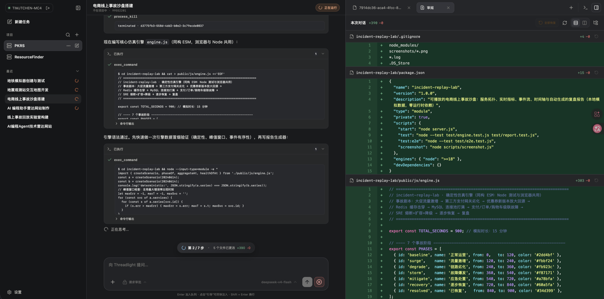
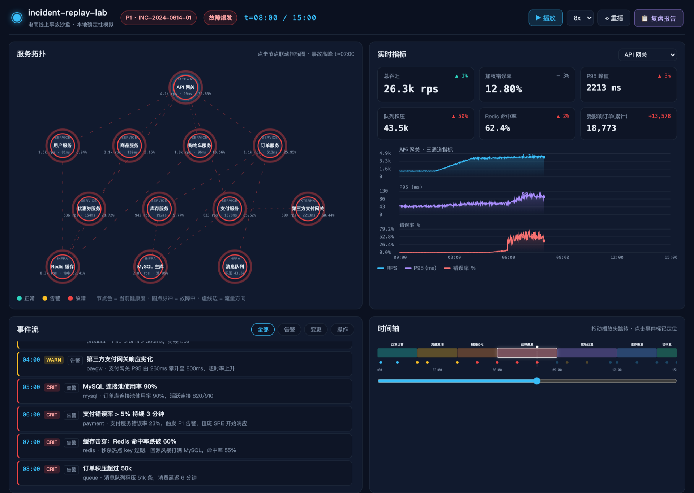
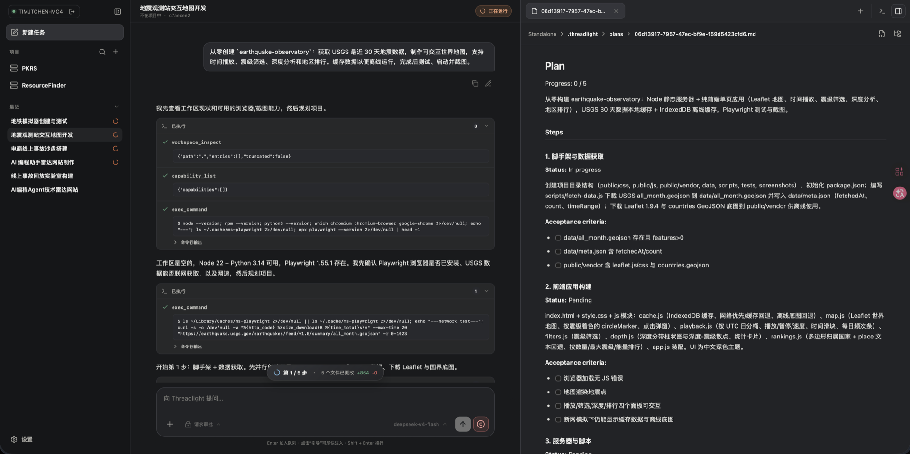
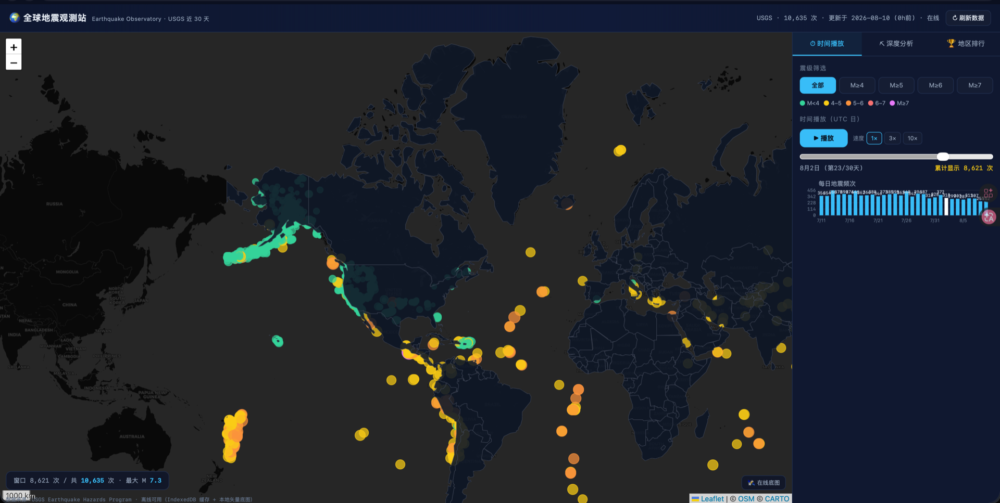
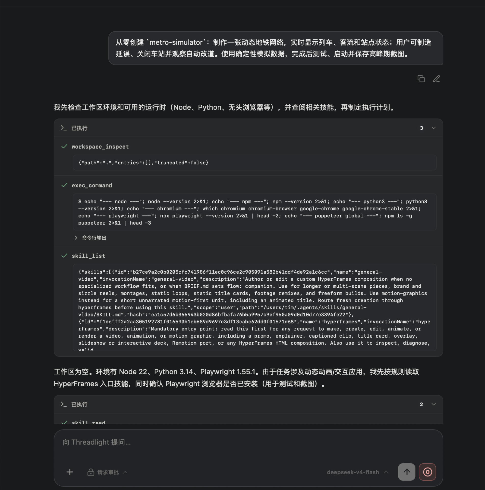
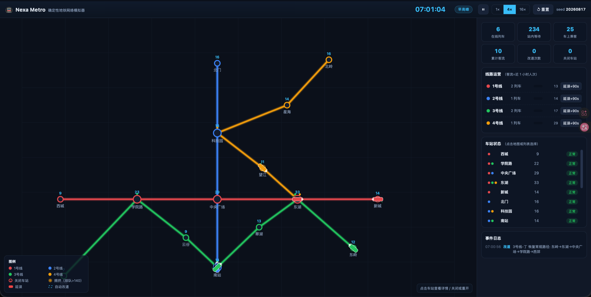
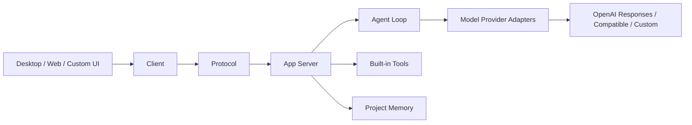

<p align="center">
  
</p>

<h1 align="center">Threadlight</h1>

<p align="center">An open-source multi-agent engineering runtime that keeps planning, delegation, tools, terminals, files, diffs, and delivery on one observable, recoverable task timeline.</p>

<p align="center">
  <a href="./README.md">中文</a> ·
  <a href="https://threadlight.xyz">Website</a> ·
  <a href="./docs/SELF_HOSTING.md">Self-hosting</a> ·
  <a href="./docs/DEVELOPMENT.md">Development</a>
</p>

<p align="center">
  <a href="https://github.com/nagisa77/threadlight/actions/workflows/ci.yml"></a>
  <a href="https://github.com/nagisa77/threadlight/releases/latest"></a>
  <a href="./LICENSE"></a>
</p>

<p align="center">
  
</p>

## Why Threadlight

Real engineering work rarely ends in one model call. It moves through research, planning, delegation, tools, file changes, terminal processes, review, delivery, and interrupted runs. Threadlight turns those stages into explicit runtime state instead of hiding them behind a final chat response.

| Typical agent client | Threadlight |
| --- | --- |
| Multi-agent often means temporary parallel chats | Parent-child threads, lifecycle, messaging, and recovery are runtime behavior |
| Tool execution collapses into a final answer | Plans, tools, terminals, files, diffs, and token usage stay observable |
| Interrupted work needs its context reconstructed | Conversations, agent trees, and opaque model state persist |
| Provider protocols leak into the core loop | Vendor wire formats stay inside adapters |
| Delivery happens in separate tools | Worktrees, review, commit, push, and draft PRs share the task context |

## Showcase

Paste one query into an empty task. Threadlight can delegate the work, build the project, run it, and leave both the execution evidence and result reviewable.

| Case | Execution | Interactive result |
| --- | --- | --- |
| Incident replay lab | <a href="./docs/images/showcase/incident-replay-lab.png"></a> | <a href="./docs/images/showcase/incident-replay-lab-result.png"></a> |
| Earthquake observatory | <a href="./docs/images/showcase/earthquake-observatory.png"></a> | <a href="./docs/images/showcase/earthquake-observatory-result.png"></a> |
| Metro operations simulator | <a href="./docs/images/showcase/metro-simulator.png"></a> | <a href="./docs/images/showcase/metro-simulator-result.png"></a> |

## Quick start

| I want to… | Start here |
| --- | --- |
| Run a complete Host + Web on my Mac or Linux machine | [One-line self-hosting](#recommended-self-host-host--web) |
| Use the native macOS workspace | [Download the desktop app](#macos-desktop-app) |
| Connect a browser to my own remote Host | [Use the Web client](#web-client) |

### Recommended: self-host Host + Web

Requires Node.js 22+ on macOS or Linux:

```bash
curl -fsSL https://threadlight.xyz/install.sh | sh
```

The installer downloads Host + Web, creates a random token, and registers a launchd or systemd user service. The Host starts empty; open the printed address, enter the token, and add projects from the UI.

```bash
~/.local/share/threadlight-self-host/bin/threadlight-self-host status
~/.local/share/threadlight-self-host/bin/threadlight-self-host logs
~/.local/share/threadlight-self-host/bin/threadlight-self-host show-token
```

The default listener is `127.0.0.1:7432`. For remote access, use an SSH tunnel, VPN, or HTTPS reverse proxy instead of exposing plaintext HTTP publicly.

### macOS desktop app

[Download the unsigned Apple Silicon test DMG](https://github.com/nagisa77/threadlight/releases/download/v1.0.0/Threadlight-1.0.0-macOS-arm64-unsigned-test.dmg)

This is an **unsigned test build**. After installation, Control-click Threadlight in Finder and choose Open. If macOS still blocks it, use System Settings → Privacy & Security → Open Anyway.

```text
SHA-256: 838f0a26e9f575cdb33e694b4fa923d865bde060581ab45104ae2f2266d74e0a
```

### Web client

[Open Threadlight Web](https://nagisa77.github.io/threadlight/)

The Web client does not provide an execution environment. Install only the Host and allow the hosted Web client with one command:

```bash
curl -fsSL https://threadlight.xyz/install.sh | sh -s -- install --host-only --origin https://nagisa77.github.io
```

Expose the Host port through an HTTPS domain, then connect with the Host URL and token printed by the installer.

## Capabilities

| Capability                | What Threadlight provides                                                                                 |
| ------------------------- | --------------------------------------------------------------------------------------------------------- |
| Multi-agent orchestration | A root agent can delegate, follow up, wait, retry, interrupt, and collect child-agent results.            |
| Controlled Plan mode      | Read-only research comes first; execution advances against acceptance evidence and cannot finish early.   |
| Observable execution      | Plans, model output, tool calls, command logs, file changes, sources, and token usage remain visible.     |
| Engineering workspace     | Conversation, Git worktrees, files, diffs, terminals, review, commits, pushes, and PRs share one context. |
| Provider-neutral core     | The Agent Loop does not depend on vendor wire formats; model protocols live in separate adapters.         |
| Local and remote Hosts    | Desktop and Web share one protocol while code, models, terminals, and data stay on the target machine.    |
| Skills, Plugins, and MCP  | Discoverable capabilities compose explicitly and are snapshotted with each task.                          |
| Recoverable state         | Conversations, agent trees, and opaque model state persist across tool turns and interrupted runs.        |

Built-in tools run with the current user's permissions and are not an operating-system sandbox. Use trusted workspaces or add container/VM isolation.

## Architecture

Threadlight separates interaction, transport, runtime, and provider adaptation. `agent-loop` knows nothing about HTTP, JSON-RPC, or vendor wire formats. `app-server` coordinates threads and turns without moving transport concerns into the loop. Provider state remains opaque and survives tool turns.



| Boundary | Owns | Must not own |
| --- | --- | --- |
| `packages/agent-loop` | Provider-neutral model/tool loop, multi-agent scheduling, lifecycle | HTTP, JSON-RPC, vendor wire formats |
| `packages/model-providers` | Adapt concrete model protocols to `ModelProvider` | Workspace, UI, or delivery policy |
| `packages/app-server` | Threads, turns, capabilities, persistence, runtime coordination | Desktop windows, Web routing, visual state |
| `packages/protocol` + `packages/client` | Stable data contracts and a transport-neutral client | Model reasoning policy |
| `packages/host-core` + `packages/terminal-core` | Workspaces, delivery, automation, and terminal primitives | Provider-specific protocols |
| `packages/ui` | Shared Desktop/Web product interface | Electron main-process or Host transport details |

## Development and verification

```bash
npm install
npm test
```

Every new behavior requires an offline test driven by a scripted model provider. Run the complete quality gate before submitting changes:

```bash
npm run check
```

See the [development guide](./docs/DEVELOPMENT.md) and [contributing guide](./CONTRIBUTING.md).

## Current boundaries

- The macOS desktop app currently targets Apple Silicon first and is distributed as an unsigned test build.
- The Web client is only an interface and must connect to your Host. Never expose a plaintext Host port publicly.
- Approval mode controls tool writes and external access; it is not an operating-system sandbox.
- Threadlight fits trusted local and self-hosted engineering workflows. Review permissions, network exposure, and isolation before production use.

Apache-2.0 · [Source](https://github.com/nagisa77/threadlight) · [Contributing](./CONTRIBUTING.md)
