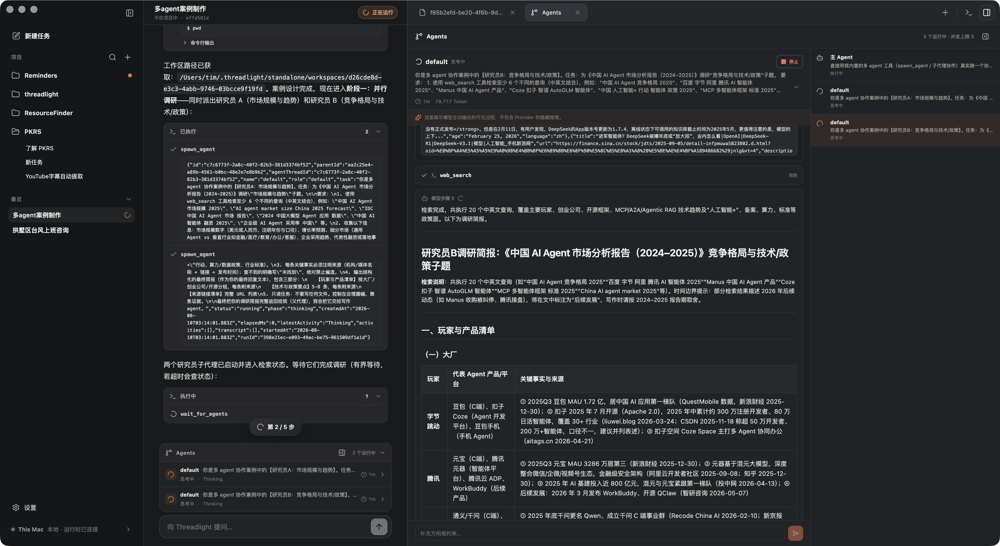
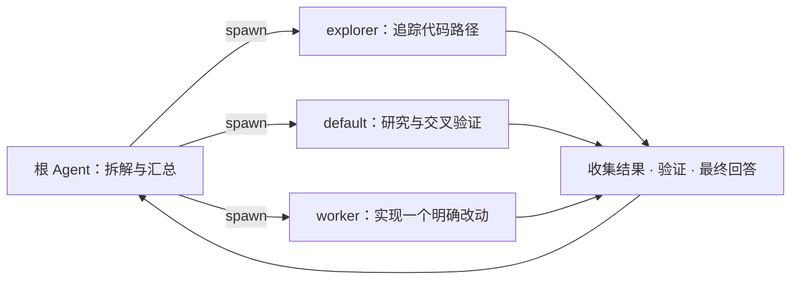
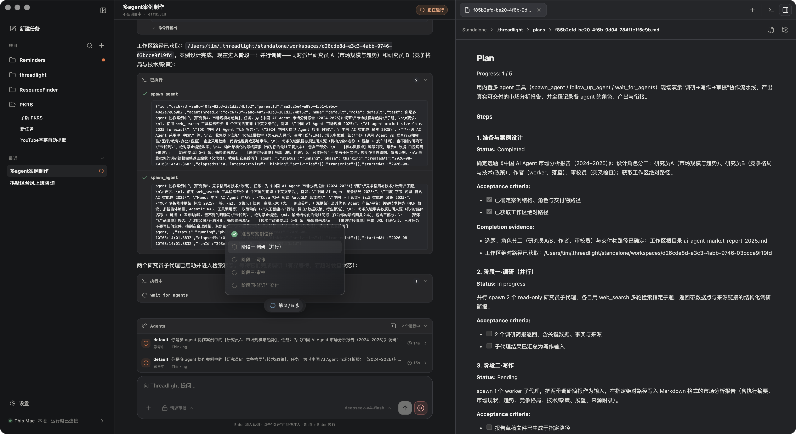
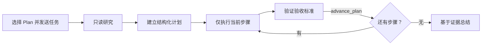
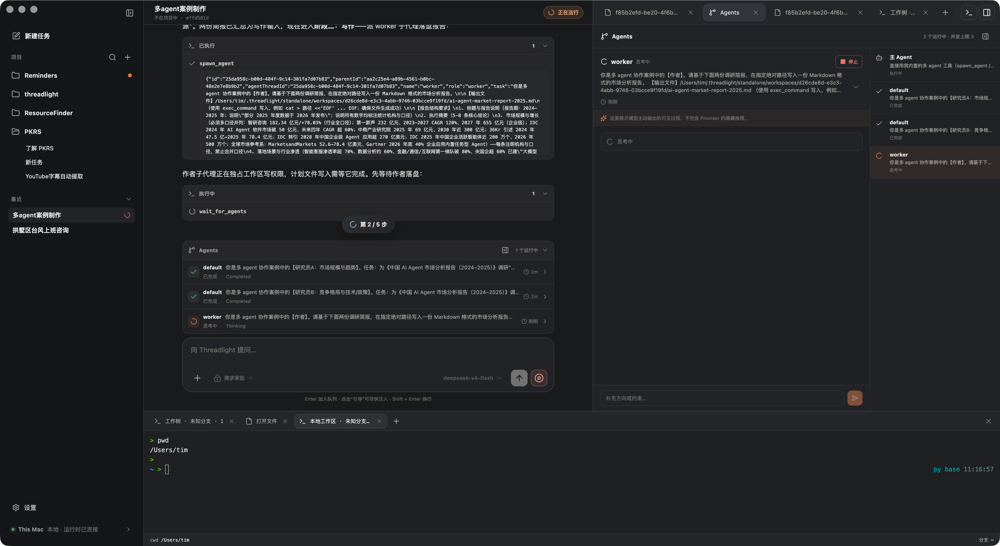
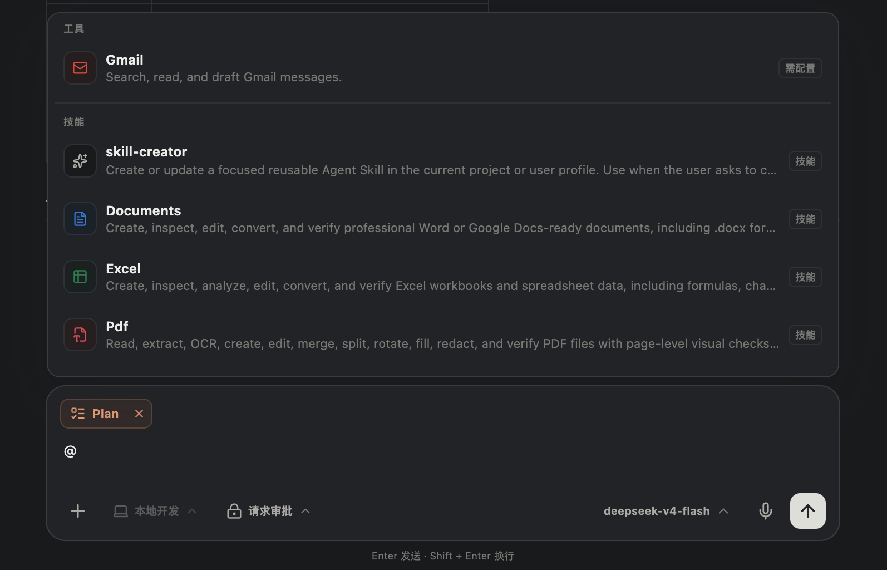
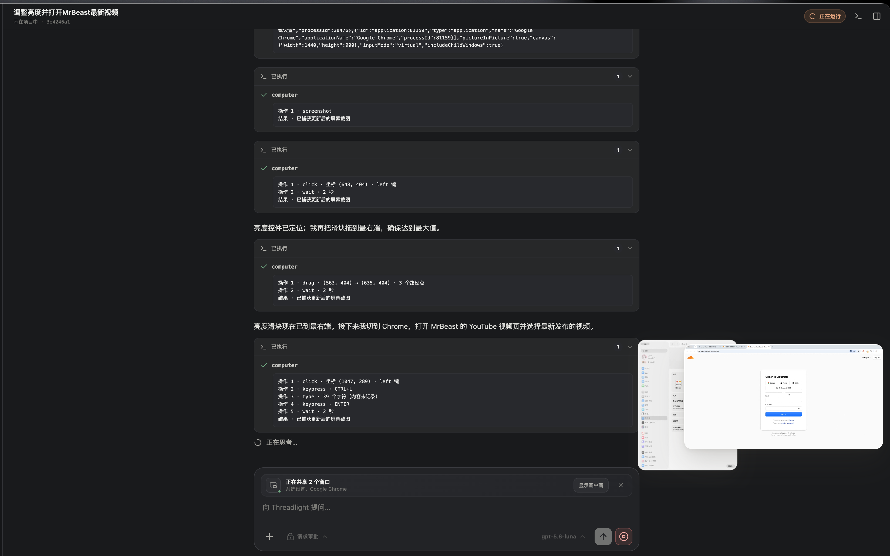
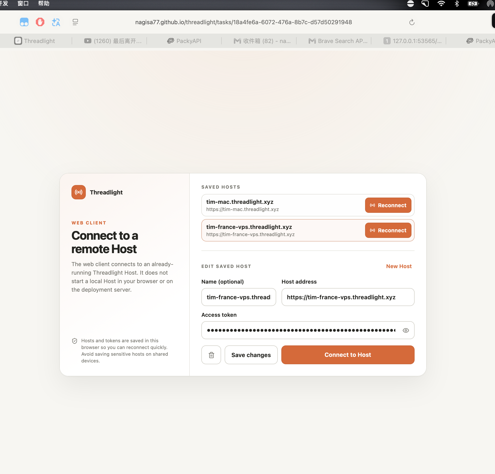
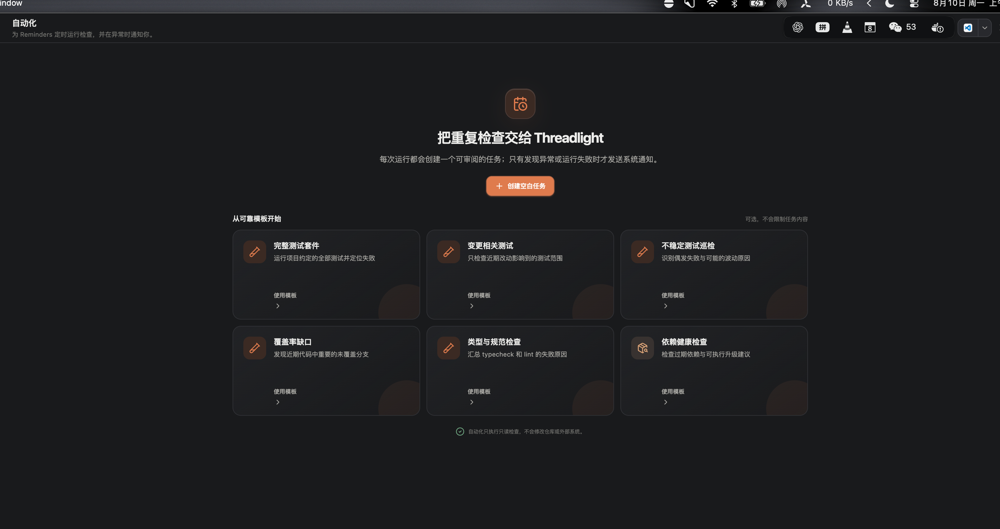
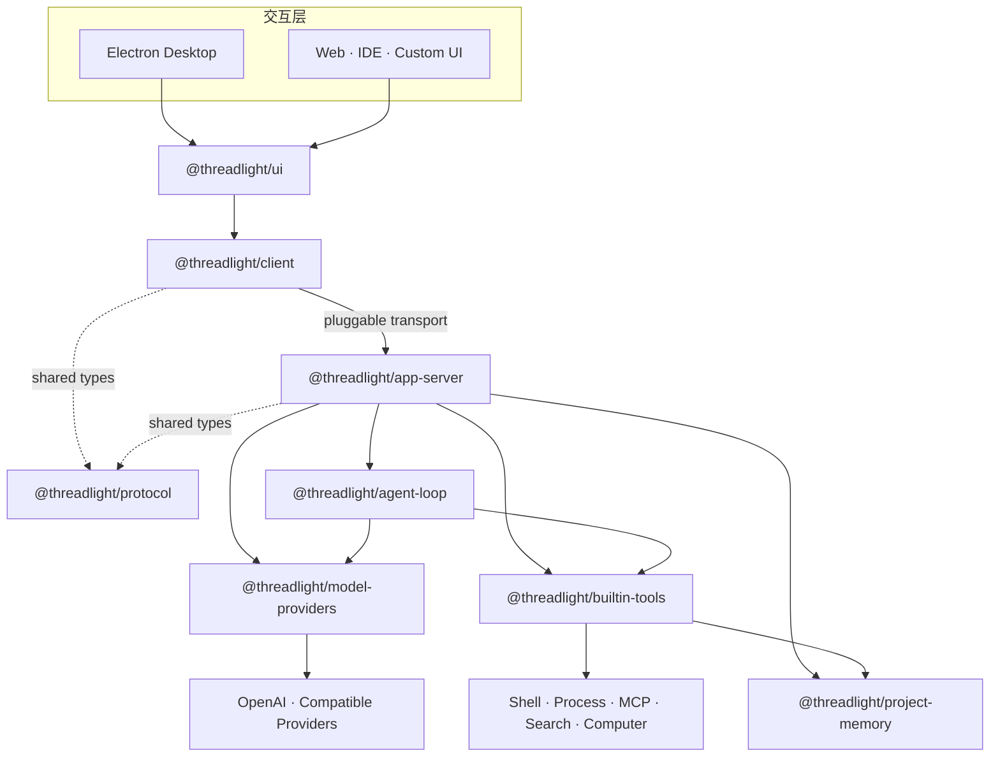

<div align="center">
  

  <h1>Threadlight</h1>

  <p><strong>让一个 Agent，真正变成一支可观察、可协作、可交付的本地工程团队。</strong></p>
  <p>
    开源的多 Agent Runtime、桌面工作台与远程 Host。<br />
    在同一条任务时间线上完成规划、并行协作、工具执行、终端操作、代码审阅与结果交付。
  </p>

  <p>
    <a href="#五分钟开始使用">开始使用</a>
    ·
    <a href="#多-agent不是多开几个聊天窗口">多 Agent</a>
    ·
    <a href="#plan-模式先研究再按证据推进">Plan 模式</a>
    ·
    <a href="#架构">架构</a>
    ·
    <a href="./README.en.md">English</a>
  </p>

  <p>
    
    <a href="https://github.com/nagisa77/threadlight/releases/latest"></a>
    <a href="https://github.com/nagisa77/threadlight/actions/workflows/ci.yml"></a>
    
    
    
  </p>
</div>

<p align="center">
  
</p>
<p align="center"><sub>一个窗口容纳多 Agent 协作、受控计划、执行记录、文件上下文与真实终端。</sub></p>

Threadlight 不是“又一个 AI 聊天框”。它把一个真实工程任务拆成可持久化的 Thread、Turn、模型增量、工具调用、子 Agent、后台进程、文件变更和交付记录，并把它们重新组织成一个可以观察、恢复和继续工作的本地工作空间。

你既可以把 Threadlight 当作开箱即用的桌面 Agent，也可以把其中的 provider-neutral Agent Loop、协议、客户端和内置工具拆出来，构建自己的 Agent 产品。

> [!IMPORTANT]
> Threadlight 1.0 是首个正式版本，面向可信的本地工程工作流。内置工具以当前用户权限运行，并不提供操作系统级 sandbox；请只在可信工作区使用，强隔离场景请配合容器、虚拟机或系统 sandbox。

## 一眼看懂 Threadlight

| 你关心的能力 | Threadlight 如何实现 |
| --- | --- |
| **多 Agent 并行协作** | 根 Agent 可以即时派出多个子 Agent，持续检查、等待、追问、重试或中断；UI 实时展示 Agent 树、阶段、活动与输出。 |
| **受控 Plan 模式** | 先只读研究，再建立带细节和验收标准的计划；运行时按顺序推进步骤，并拒绝没有完成证据的提前收尾。 |
| **全过程可观察** | 模型输出、工具调用、命令日志、子 Agent、文件变化、来源引用与 token usage 都进入同一条时间线。 |
| **真正面向工程交付** | Git 项目默认使用独立 worktree；对话、Diff、文件树、终端、Commit、Push、PR 与 Review 保持在同一上下文中。 |
| **Provider 中立** | Agent Loop 不感知厂商 wire format；OpenAI Responses 与多种 OpenAI-compatible 服务通过独立 adapter 接入。 |
| **本地优先，也能远程** | 桌面端可运行本机 Host，也能连接远程 Host；Web 客户端复用同一套 UI 和协议。 |
| **可扩展能力系统** | Skills、Plugins、MCP、内置工具和自定义子 Agent Profile 都有清晰的发现、快照与权限边界。 |
| **可恢复、可验证** | 会话和 opaque model state 持久化；新行为使用 scripted model provider 离线测试，无需真实 API 即可复现工具链。 |

## 多 Agent：不是多开几个聊天窗口

<p align="center">
  
</p>
<p align="center"><sub>父 Agent 负责拆解与汇总，多个子 Agent 在独立上下文中并行研究、执行和回传结果。</sub></p>

Threadlight 的多 Agent 是运行时级编排，不是把同一个问题复制给几个聊天窗口。

根 Agent 可以把互相独立的工作拆给多个角色，`spawn_agent` 会立即返回，因此研究、代码路径追踪和互不冲突的分析可以真正并行。父 Agent 随后可以查看进度、等待有意义的更新、给同一 Agent 追加问题、从全新状态重试、主动中断，或关闭已经结束的 Agent 线程。



### 运行时替你处理的协作细节

- **真实并发。** 默认最多同时运行 3 个子 Agent、单轮最多创建 8 个子任务；上限可以由 Host 配置调整。
- **连续的 Agent 线程。** 对同一 Agent 使用 follow-up 时会保留它自己的 provider model state 和历史，不需要重新解释全部背景。
- **结果必须被收集。** 仍有活跃 Agent，或某个结果尚未被父 Agent 收集时，根 Agent 不能直接结束任务。
- **安全的写入所有权。** `worker` 获得工作区写权限时，其他写入会被运行时拦截；读操作仍可继续，避免并行修改互相踩踏。
- **可恢复的运行快照。** Agent 状态、活动、输出、模型状态和父子关系会进入运行时 checkpoint，任务恢复后仍能继续呈现。
- **分层诊断。** 多 Agent 回合分别统计 root、children 和 total 的 token 与执行指标，便于理解并发成本。

### 内置角色与自定义角色

| Profile | 默认权限 | 适合做什么 |
| --- | --- | --- |
| `default` | 只读 | 通用研究、评审、独立分析与结论合成。 |
| `explorer` | 只读 | 快速搜索仓库、追踪符号和调用链、返回文件级证据。 |
| `worker` | 可写 | 在独占写入所有权下实现一个边界明确的改动，并报告文件与测试证据。 |

你可以在 `~/.threadlight/agents/*.toml` 定义个人角色，也可以在 `<project>/.threadlight/agents/*.toml` 定义项目角色；同名配置按“项目 > 个人 > 内置”覆盖。

```toml
# .threadlight/agents/security-audit.toml
description = "审计仓库的权限边界与敏感数据流"
instructions = """
追踪不可信输入、权限边界和敏感数据流。
只报告有证据的风险，不修改仓库。
"""
tool_access = "read-only"
excluded_tools = ["project_memory"]
model = "YOUR_MODEL_ID"
provider = "openai"
max_steps = 12
```

### 直接这样提问

```text
用多 Agent 分析这个仓库：
1. explorer 追踪认证链路；
2. default 检查威胁模型和边界条件；
3. worker 只修复已经确认的最高优先级问题；
最后汇总证据、改动和测试结果。
```

## Plan 模式：先研究，再按证据推进

<p align="center">
  
</p>
<p align="center"><sub>计划不是一次性清单：每一步都有状态、验收标准和完成证据，并由运行时控制推进。</sub></p>

普通任务适合直接行动；范围大、约束多、需要先确认方案的任务更适合 Plan 模式。在输入框左下角点击 `+`，选择 **Plan**，它只对当前一轮生效。

Plan 模式不是一段“请先列计划”的 Prompt，而是由运行时控制的状态机：



### 它具体控制什么

1. **Research phase**：初始阶段只能使用只读工具。写工具仍会显示，方便模型了解能力，但调用会被运行时拒绝。
2. **结构化计划**：每一步都必须包含短标题、可执行细节、验收标准和状态；初始计划必须恰好有一个 `in_progress` 步骤。
3. **线性推进**：模型一次只能处理当前步骤，不能跳过 Pending 步骤，也不能悄悄改写已经完成的工作。
4. **证据驱动**：每条验收标准都要对应一条 `completionEvidence`，然后才能通过 `advance_plan` 进入下一步。
5. **问题有交代**：失败或警告的工具调用必须给出恢复方式、替代证据或明确限制，不能被静默忽略。
6. **拒绝提前结束**：计划仍在研究、执行或等待证据时，运行时会拒绝模型的最终回答。
7. **计划可阅读**：结构化状态会同步为 `.threadlight/plans/<run-id>.md`，并自动在右侧面板渲染。

| 模式 | 推荐场景 | 行为 |
| --- | --- | --- |
| **默认模式** | 小修复、明确命令、快速问答 | Agent 直接行动，必要时自行组织轻量步骤。 |
| **Plan 模式** | 跨模块改造、迁移、审计、发布规划 | 先只读研究，再按受控计划与验收证据逐步推进。 |

## 一个为 Agent 工作流设计的桌面工作台

### 对话、执行记录和结果在同一条时间线

每个 Turn 都可以流式展示回答、工具活动、命令输出、来源引用、附件和子 Agent 状态。折叠的执行记录保持主对话干净，需要审计时再展开。中断、恢复或重新进入任务后，原来的链路仍然存在。

### 在对话旁边直接 Review 改动

<!-- SCREENSHOT: docs/images/threadlight-agent-review.png | 1440×900 | Git 项目任务；中间是完成总结和变更统计，右侧 Review 展示清晰 Diff 与文件树，画面不含个人路径或敏感内容。 -->

右侧面板可以打开源码、会话变更和 Diff。你可以按文件审阅、切换布局、查看文件树，并在恢复变更前检查工作区冲突。

Git 项目中的新任务默认运行在独立 worktree：Agent 的修改与当前工作目录隔离。完成后可以继续 Commit、Push、创建 Draft PR，并在 Review 中查看 CI 与 review comments。非 Git 项目则直接写入所选目录。

### 终端和文件是任务的一部分

<p align="center">
  
</p>
<p align="center"><sub>Agent 线程、文件和多个终端标签共享同一任务上下文。</sub></p>

底部工作区支持多个终端与文件标签。前台命令超时后会转入受管后台进程，Agent 可以继续查询状态、增量读取输出、等待或终止，而不是用不透明的系统 PID 猜测进度。

### 为长任务准备的日常细节

- **全局搜索与命令面板**：快速搜索项目和任务，并从键盘进入常用操作。
- **完整任务管理**：按状态筛选、重命名、置顶和归档；永久删除只对已归档任务开放。
- **运行中继续输入**：Agent 工作时仍可加入后续消息；普通消息排队，“引导”消息会尽快注入当前运行。
- **附件与语音**：支持图片和文件拖放、附件预览与语音转写输入。
- **可调整工作区**：侧栏、对话、右侧面板和底部面板都围绕长时间工程任务设计，不必在聊天、编辑器和终端之间反复搬运上下文。

### 安全执行不是一句提醒

“请求审批”模式会自动允许只读操作；写入和外部访问会在执行前询问，并可授权一次、当前任务或当前项目。删除、强制重置和清理仓库等破坏性操作会继续被阻止。

“完全访问”适合你明确可信的任务，它会绕过上述审批。两种模式都不是系统 sandbox。

## 不只会写代码

### 项目记忆：把稳定知识留在项目里

<p align="center">
  
</p>
<p align="center"><sub>把架构决定、项目约定、常用命令和已验证事实沉淀成可阅读的长期上下文。</sub></p>

项目长期记忆存放在可读的 `.threadlight/MEMORY.md`。新任务读取创建时的上下文快照；Agent 更新记忆时必须携带 revision，避免并发写入静默覆盖。

适合记录：稳定的架构决定、验证过的项目事实、长期约定和常用命令。不适合记录：密钥、聊天全文、临时任务状态或未经验证的猜测。

### Skills、Plugins 与 MCP：能力可以组合

<p align="center">
  
</p>
<p align="center"><sub>工具、Skills、Plugins、MCP 与 Plan 都可以在输入框中按当前任务组合。</sub></p>

- **Skills** 使用兼容 Agent Skills 的 `SKILL.md` 格式，支持项目级、用户级、显式 `$skill-name` 和描述匹配后的渐进加载。
- **Plugins** 使用 `.codex-plugin/plugin.json`，可以一起声明 Skills 和 MCP Servers。
- **MCP** 支持临时 stdio 与 Streamable HTTP runtime；远程 MCP 支持 OAuth 2.1 authorization code + S256 PKCE。
- **能力快照** 会随任务持久化。恢复旧任务时继续使用原来的 Prompt、Skill 和 Plugin 快照，避免扩展升级后污染已有模型状态。
- **Composer 选择**：输入 `@` 搜索工具与技能，或用 `+` 菜单添加文件和 Plan；选中的能力只对当前一轮生效。

### 模型、主题和语言统一管理

<p align="center">
  
</p>
<p align="center"><sub>主题、语言、首选编辑器、Provider 与模型配置集中管理，并自动安全保存。</sub></p>

桌面端支持 OpenAI、Kimi、豆包、Gemini、Grok、DeepSeek、阿里云百炼·千问，以及自定义 OpenAI-compatible 服务。不同任务可以选择不同模型。

界面支持简体中文、繁體中文、English、日本語与 한국어，以及跟随系统、浅色和深色主题。API Key 使用系统安全存储加密，不写入项目、fixtures 或日志。

### Computer Use：让 Agent 看见桌面

<p align="center">
  
</p>
<p align="center"><sub>Agent 可以观察共享窗口、执行可审计的桌面操作，并通过画中画同步展示它看到的内容。</sub></p>

macOS 桌面端可以选择一个或多个 App、窗口或显示器，将它们组合成 1440 × 900 的稳定画布，并用不抢焦点的置顶画中画同步展示 Agent 看到的内容。支持优先使用 Accessibility action 定向输入，也可以在必要时显式启用 system input 兼容模式。

首次使用需要屏幕录制与辅助功能权限。设置 `THREADLIGHT_COMPUTER_USE=0` 可以关闭该能力。

### 本地桌面、远程 Host 与 Web 共用一套工作域

<p align="center">
  
</p>
<p align="center"><sub>保存多个 Host，在浏览器中连接远程开发机，并让代码与模型执行留在目标环境。</sub></p>

桌面端可以连接本机 Host，也能通过 SSH 隧道、VPN 或 HTTPS 反向代理连接远程开发机。Host 管理项目、任务、设置、终端和 Agent Runtime；桌面端与 Web 端只是不同交互表面。

这意味着你可以把代码和模型执行留在远程机器上，同时在本地桌面或浏览器中继续同一任务。

### 自动化：让重复检查自己运行

<p align="center">
  
</p>
<p align="center"><sub>从可靠模板或自定义 Prompt 创建定时检查，每次运行都生成一个可以回看和审计的任务。</sub></p>

每个项目都可以安排只读 Agent 任务，按每天、工作日或每周运行。内置模板覆盖完整测试、相关测试、依赖健康、安全审计、Issue 分类、发布准备度、文档漂移、无障碍和本地化检查，也可以使用自己的 Prompt。

每次运行都会生成普通 Thread，因此过程、工具记录和结果仍然可以被审阅；你也可以随时手动运行、暂停或修改计划。

## 五分钟开始使用

### 方式一：下载桌面端

从 [Releases](https://github.com/nagisa77/threadlight/releases/latest) 下载最新构建。Threadlight 当前优先面向 macOS 桌面工作流。

首次打开后：

1. 进入 **设置**，选择 Provider，填写 API Key 和默认模型。
2. 点击 **添加项目**，选择一个可信的本地文件夹。
3. 保持默认的 **请求审批**，先让 Agent 读取项目并说明它准备怎么做。
4. 小任务直接发送；复杂任务点击输入框左下角 `+`，选择 **Plan**。
5. 需要并行研究时，在任务里明确写出“使用多 Agent”，并说明希望拆分的维度。
6. 完成后在右侧 **Review** 检查 Diff，再决定是否 Commit、Push 或创建 PR。

### 推荐的第一个任务

```text
先只读检查这个项目，不要修改文件。
请概括项目结构、开发与测试命令、关键架构边界，
并建议一个适合作为下一步的小改进。
```

确认工作区和模型配置正确后，再尝试：

```text
使用 Plan 模式实现这个改进。
先研究相关代码和测试，给出带验收标准的计划，
然后逐步实现；每一步完成前都要提供可验证的证据。
```

或用多 Agent 做一次并行评审：

```text
使用多 Agent 评审当前实现：
- explorer 追踪关键调用链；
- default 检查边界条件和潜在回归；
- worker 只处理已经确认的问题。
最后统一汇总证据、改动文件和测试结果。
```

### 方式二：从源码运行

环境要求：Node.js 22 或更高版本、npm。macOS Computer Use 还需要屏幕录制与辅助功能权限。

```bash
git clone https://github.com/nagisa77/threadlight.git
cd threadlight
npm install
npm test
npm run desktop:dev
```

构建并预览 production bundle：

```bash
npm run desktop:preview
```

生成当前 Mac 架构的独立 `.app`：

```bash
npm run desktop:package
```

## 配置模型服务

推荐在桌面端设置页中配置。也可以通过环境变量启动：

| Provider | 必需配置 | 可选配置 |
| --- | --- | --- |
| OpenAI | `OPENAI_API_KEY` | `THREADLIGHT_MODEL` |
| DeepSeek | `THREADLIGHT_PROVIDER=deepseek`、`DEEPSEEK_API_KEY` | `THREADLIGHT_MODEL` |
| Kimi | `THREADLIGHT_PROVIDER=kimi`、`MOONSHOT_API_KEY` | `MOONSHOT_BASE_URL`、`THREADLIGHT_MODEL` |
| 豆包 | `THREADLIGHT_PROVIDER=doubao`、`ARK_API_KEY` | `ARK_BASE_URL`、`THREADLIGHT_MODEL` |
| Gemini | `THREADLIGHT_PROVIDER=gemini`、`GEMINI_API_KEY` | `GEMINI_BASE_URL`、`THREADLIGHT_MODEL` |
| Grok | `THREADLIGHT_PROVIDER=grok`、`XAI_API_KEY` | `XAI_BASE_URL`、`THREADLIGHT_MODEL` |
| 千问 | `THREADLIGHT_PROVIDER=qwen`、`DASHSCOPE_API_KEY` | `DASHSCOPE_BASE_URL`、`THREADLIGHT_MODEL` |
| 自定义兼容服务 | `THREADLIGHT_PROVIDER=custom`、`CUSTOM_BASE_URL`、`THREADLIGHT_MODEL` | `CUSTOM_API_KEY` |

```bash
export OPENAI_API_KEY="your-key"
export THREADLIGHT_MODEL="YOUR_MODEL_ID"

# 可选：启用 web_search
export BRAVE_SEARCH_API_KEY="your-key"

npm run desktop:dev
```

密钥不会被写入源码、fixtures 或日志。请不要把真实密钥提交到仓库。

## 远程 Host

在远程开发机、容器或 SSH workspace 中安装项目后启动无 UI Host：

```bash
export THREADLIGHT_HOST_TOKEN="$(openssl rand -hex 32)"

npm run host:dev -- \
  --host 127.0.0.1 \
  --port 7432
```

推荐只监听回环地址，并通过 SSH 隧道连接：

```bash
ssh -N -L 7432:127.0.0.1:7432 user@development-host
```

Host 的全局设置保存在远端 `~/.threadlight`，项目数据保存在各项目的 `.threadlight`。桌面端切换 Host 后只显示该 Host 的项目和任务。

容器中可以改为 `--host 0.0.0.0`，但跨不可信网络时必须使用 HTTPS 反向代理、VPN 或 SSH 隧道。完整说明见 [远程 Host 文档](./docs/REMOTE_HOST.zh-CN.md)。

生成便于复制到远程机器的无 UI 包：

```bash
npm run host:package
```

## Web 客户端

Web 端复用桌面端的 `@threadlight/ui`，只连接已经运行的远程 Host，不会在浏览器或部署服务器上启动 Host。

```bash
# 开发
VITE_THREADLIGHT_HOST_URL=http://127.0.0.1:7432 npm run web:dev

# Production 静态构建
VITE_THREADLIGHT_HOST_URL=https://host.example.com npm run web:build
```

Host 必须通过 `--origin` 明确允许 Web 地址。HTTPS 页面需要 HTTPS/WSS Host。部署、TLS 反向代理、Nginx SPA fallback 与本地联调见 [Web 部署文档](./docs/WEB_DEPLOYMENT.zh-CN.md)。

## 架构



四条边界贯穿整个项目：

1. **Loop 不感知厂商协议。** `agent-loop` 只依赖 `ModelProvider`；wire format、附件上传和 opaque state 转换留在 adapter。
2. **Server 不侵入执行核心。** `app-server` 负责 JSON-RPC、任务生命周期、持久化和 transport，不把这些职责下沉到 loop。
3. **Client 与 Server 只共享协议。** 两端通过 `@threadlight/protocol` 对齐类型，不形成实现层循环依赖。
4. **工具是能力边界。** 命令、进程、MCP、搜索、项目记忆与 Computer Use 实现统一 `Tool` 接口，可按运行环境组合或替换。

### 为什么保留 opaque model state

一次真实任务会跨越多轮模型调用和工具执行。Threadlight 在工具回合之间原样保留 provider 返回的 opaque state，让 reasoning continuity、call linkage 和 provider 自己的缓存语义不会因为一次工具调用而丢失。

这个状态只由对应 adapter 解释；切换 Provider 时不会把一个厂商的私有状态错误重放给另一个厂商。

## 作为 Runtime 使用

### Agent Loop

```ts
import { AgentLoop, defineAgent } from "@threadlight/agent-loop";
import { createExecCommandTool } from "@threadlight/builtin-tools";
import { OpenAIResponsesProvider } from "@threadlight/model-providers";

const loop = new AgentLoop(
  new OpenAIResponsesProvider({ defaultModel: "YOUR_MODEL_ID" }),
);

const result = await loop.run(
  defineAgent({
    name: "assistant",
    instructions: "Use tools when they provide verifiable evidence.",
    tools: [createExecCommandTool({ workspaceRoot: process.cwd() })],
  }),
  "运行测试并总结结果",
  { onEvent: (event) => console.log(event) },
);

console.log(result.output);
```

### 类型安全客户端

```ts
import { ThreadlightClient } from "@threadlight/client";

const client = new ThreadlightClient(transport);
await client.initialize();

const { threadId } = await client.startThread();
client.on("turn/completed", ({ output }) => console.log(output));

await client.startTurn(threadId, "分析当前工作区");
```

客户端只要求 transport 能发送请求并订阅服务端消息。桌面端使用 JSONL/stdio；Web、IDE 或自定义 UI 可以接入其他 transport，上层调用保持不变。

## 数据与安全

```text
~/.threadlight/
├── settings.json                 # 模型服务与全局偏好
├── connection-store.json         # safeStorage 加密的 connector OAuth 状态
├── agents/                       # 可选的个人子 Agent Profiles
└── project-map.json              # 项目、路径与任务摘要索引

<project>/.threadlight/
├── MEMORY.md                     # 用户可读的长期项目记忆
├── agents/                       # 可选的项目子 Agent Profiles
├── plans/                        # Plan 模式生成的可读计划文档
├── plugins/                      # 可选的项目 Plugins
└── conversations/
    └── <threadId>.json           # 会话与受限、脱敏的 opaque model state
```

- 密钥只从运行时环境或系统安全存储注入，不进入源码、fixtures、项目文件或日志。
- app-server 的协议输出与诊断日志分别写入 stdout 和 stderr。
- 持久化 opaque model state 的单任务上限为 5 MiB；Computer Use 截图写盘前会替换为占位图。
- 附件通过受校验的本地路径引用，wire adapter 不直接内联任意文件字节。
- 远程 MCP OAuth token、PKCE verifier 和动态客户端信息经 Electron `safeStorage` 加密保存。
- `.threadlight/` 默认应加入版本控制忽略规则；如果希望共享 `MEMORY.md`，请按团队策略单独处理。
- 内置工具不是系统 sandbox；需要强隔离时，请在容器、虚拟机或操作系统 sandbox 中运行。

## Monorepo

```text
threadlight/
├── apps/
│   ├── desktop/              Electron 主进程、preload、renderer 与原生输入桥
│   └── web/                  连接远程 Host 的浏览器客户端
├── packages/
│   ├── agent-loop/           Provider-neutral Agent Loop 与多 Agent 编排
│   ├── model-providers/      模型厂商 adapters
│   ├── project-memory/       原子 Markdown 存储与 revision 校验
│   ├── builtin-tools/        命令、进程、Plan、MCP、搜索、记忆与 Computer Use
│   ├── protocol/             JSON-RPC 请求、响应、通知与共享类型
│   ├── app-server/           Thread / Turn 编排、持久化与 transports
│   ├── client/               类型安全、transport-neutral 客户端
│   ├── ui/                   桌面端和 Web 复用的 React 工作台
│   ├── host-core/            Host 运行时共享能力
│   ├── terminal-core/        终端会话与后台进程基础能力
│   └── web-runtime/          Web Host transport 与连接状态
└── test/                     跨 package 集成测试
```

## 开发与验证

第一次贡献请从 [完整开发指南](./docs/DEVELOPMENT.zh-CN.md) 开始。提交规范见 [CONTRIBUTING.md](./CONTRIBUTING.md)。

```bash
npm run build       # 构建 packages、桌面端与 Web
npm run typecheck   # TypeScript 类型检查
npm test            # 完整离线测试
npm run check       # 格式、Lint、类型与覆盖率
npm run clean       # 清理 TypeScript build artifacts
```

提交新行为时，请同时添加使用 scripted model provider 的离线测试，并遵守这些架构约束：

- `agent-loop` 必须保持 provider-neutral。
- 厂商 wire format 只能出现在 adapter 中。
- `app-server` 的 transport / protocol 职责不能进入 loop。
- 工具回合之间必须保留 opaque model state。
- 不得在源码、fixtures 或日志中写入 API Key 或其他密钥。

## 当前边界

- 1.x 将继续演进，当前仍优先面向可信的本地单用户工程工作流。
- `exec_command` 会限制工作目录、前台等待时间和输出大小，但不是系统 sandbox。
- `web_search` 当前通过 Brave Search API 提供。
- 桌面端当前优先支持 macOS；其他系统的完成度可能不同。
- stdio 已与核心协议解耦，远程 Host 使用 HTTP + NDJSON，交互式终端使用经过 Host Token 鉴权的 WebSocket。

## 参与贡献

欢迎提交 Issue、功能讨论和 Pull Request。如果你准备新增 Provider、工具、协议事件或 UI 行为，请先阅读 [开发指南](./docs/DEVELOPMENT.zh-CN.md)，并为新行为补充不依赖真实网络与 API Key 的离线测试。

Threadlight 使用 [Apache License 2.0](./LICENSE)。

---

<div align="center">
  <strong>Threadlight</strong>
  <br />
  <sub>让 Agent 的思考、协作、行动与证据，在同一条时间线上发光。</sub>
</div>
