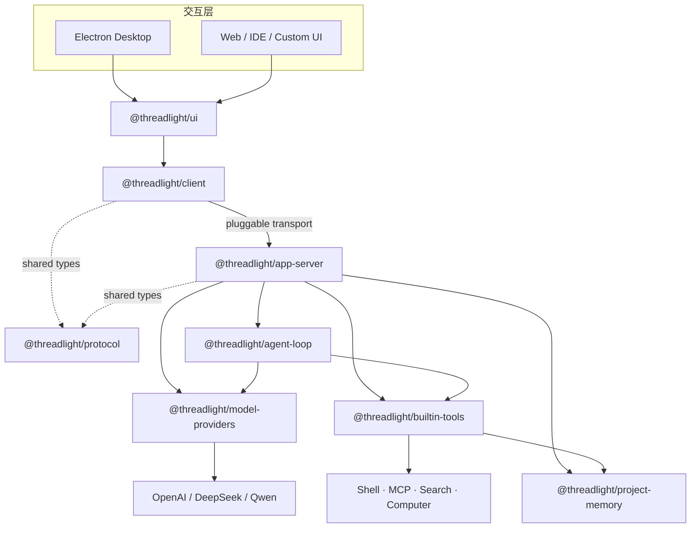

<div align="center">
  

  <h1>Threadlight</h1>

  <p><strong>面向本地工程工作的开源 Agent Runtime 与桌面客户端</strong></p>
  <p>
    将模型推理、工具调用、审批、进程、项目记忆与 Computer Use<br />
    组织为一条可观察、可恢复、可扩展的执行链路。
  </p>

  <p>
    
    
    
    
  </p>

  <p>
    <a href="#为什么是-threadlight">核心理念</a>
    ·
    <a href="#架构">架构</a>
    ·
    <a href="#快速开始">快速开始</a>
    ·
    <a href="#monorepo-地图">Monorepo</a>
    ·
    <a href="#开发与验证">开发指南</a>
  </p>
</div>

---

Threadlight 不只是一个聊天界面，也不把 Agent 简化成一次模型请求。它围绕真实的
工程任务构建：一个任务可以经历多轮模型调用、流式输出、工具执行、人工审批、
后台进程与中断恢复，同时完整保留模型需要的 opaque state。

项目由一组边界清晰的 TypeScript 包和一个 Electron 桌面端组成。核心循环保持
provider-neutral，厂商协议被隔离在 adapter 中；app-server 负责协议与会话编排，
UI 则通过类型安全客户端消费统一事件。

> [!IMPORTANT]
> Threadlight 目前处于 **Alpha** 阶段，适合本地开发、架构探索和 Agent 应用原型。
> 内置命令审批不是操作系统级 sandbox；批准后的命令仍拥有当前用户权限。

## 为什么是 Threadlight

| 能力 | Threadlight 的实现 |
| --- | --- |
| **可观察的 Agent Loop** | thread、turn、模型增量、工具调用、审批与 token usage 都以结构化事件呈现 |
| **Provider 中立** | 核心循环不依赖厂商 SDK；OpenAI Responses、DeepSeek 与千问兼容协议由独立 adapter 接入 |
| **状态连续性** | 跨工具回合保留 opaque model state，维持推理上下文与调用链关联 |
| **本地工程上下文** | 项目、会话、附件与长期记忆围绕工作区组织，不依赖远端业务数据库 |
| **可控工具执行** | 命令执行、后台进程、MCP、Web Search 与 Computer Use 均进入统一工具和审批模型 |
| **多端可复用** | React UI、类型安全 client 与 JSON-RPC protocol 解耦，可继续接入 Web、IDE 或自定义 transport |

### 桌面端体验

- 以项目组织任务，持久化会话并支持恢复、删除和中断。
- 流式呈现回答、执行进度、工具活动和审批请求。
- 支持图片、文件拖放与语音转写输入。
- 在设置中切换 OpenAI、DeepSeek 或阿里云百炼·千问。
- 使用系统安全存储加密 API Key，不把密钥写入项目或日志。
- 在 macOS 上共享 App、窗口或显示器，并通过画中画预览 Agent 看到的稳定画布。

### Runtime 能力

- 多步骤工具循环、取消信号、审批钩子、结构化事件和 token 统计。
- 进程状态查询、增量读取、等待与终止。
- 每个会话独立的临时 MCP runtime。
- 带 revision 校验的项目长期记忆，避免并发写入静默覆盖。
- transport-neutral 的 JSON-RPC 2.0 app-server 与客户端。
- 基于 scripted model provider 的离线测试，不依赖真实模型 API。

## 架构



### 设计边界

1. **Loop 不感知厂商协议**

   `agent-loop` 只依赖 `ModelProvider` 接口。请求 wire format、附件上传和 opaque
   state 的转换全部留在 `model-providers`。

2. **Server 不侵入执行核心**

   `app-server` 处理 JSON-RPC、thread/turn 生命周期、持久化和 transport，
   不把这些职责下沉到 loop。

3. **Client 与 Server 只共享协议**

   两端通过 `@threadlight/protocol` 对齐类型，不形成实现层面的循环依赖。

4. **工具是能力边界**

   项目记忆、命令、进程、MCP、搜索和 Computer Use 都实现为统一 `Tool`，
   可以按运行环境组合、审批和替换。

## 快速开始

### 环境要求

- Node.js 22 或更高版本
- npm
- macOS：使用完整桌面端 Computer Use 时需要屏幕录制与辅助功能权限

```bash
git clone https://github.com/nagisa77/threadlight.git
cd threadlight
npm install
npm test
```

### 启动桌面端

推荐在桌面端设置页填写模型服务、模型和搜索密钥。开发模式会先构建 workspace
packages，再启动 Electron 与 renderer HMR：

```bash
export OPENAI_API_KEY="your-key"

# 可选：启用 web_search
export BRAVE_SEARCH_API_KEY="your-key"

npm run desktop:dev
```

构建并预览 production bundle：

```bash
npm run desktop:preview
```

Electron renderer 保持浏览器环境且不启用 Node integration。preload 只暴露受限的
Threadlight bridge，app-server 作为独立子进程运行。

### 切换模型服务

桌面设置页可以直接切换服务。使用环境变量启动时，可配置：

| 服务 | 必需配置 | 可选配置 |
| --- | --- | --- |
| OpenAI | `OPENAI_API_KEY` | `THREADLIGHT_MODEL` |
| DeepSeek | `THREADLIGHT_PROVIDER=deepseek`、`DEEPSEEK_API_KEY` | `THREADLIGHT_MODEL` |
| 千问 | `THREADLIGHT_PROVIDER=qwen`、`DASHSCOPE_API_KEY` | `DASHSCOPE_BASE_URL`、`THREADLIGHT_MODEL` |

```bash
# DeepSeek
export THREADLIGHT_PROVIDER="deepseek"
export DEEPSEEK_API_KEY="your-key"
export THREADLIGHT_MODEL="deepseek-v4-pro"

# 或阿里云百炼 · 千问
export THREADLIGHT_PROVIDER="qwen"
export DASHSCOPE_API_KEY="your-key"
export DASHSCOPE_BASE_URL="https://dashscope.aliyuncs.com/compatible-mode/v1"
export THREADLIGHT_MODEL="qwen3.7-plus"

npm run desktop:dev
```

### 启动 app-server

```bash
npm run build:packages
export OPENAI_API_KEY="your-key"
npm start
```

app-server 在 stdout 上收发 JSONL 协议消息，日志只写入 stderr：

```json
{"jsonrpc":"2.0","id":1,"method":"initialize"}
{"jsonrpc":"2.0","id":2,"method":"thread/start"}
{"jsonrpc":"2.0","id":3,"method":"turn/start","params":{"threadId":"<thread-id>","input":"解释这个项目的架构"}}
```

## 作为 Runtime 使用

### Agent Loop API

```ts
import { AgentLoop, defineAgent } from "@threadlight/agent-loop";
import { createExecCommandTool } from "@threadlight/builtin-tools";
import { OpenAIResponsesProvider } from "@threadlight/model-providers";

const loop = new AgentLoop(
  new OpenAIResponsesProvider({ defaultModel: "gpt-5.6-sol" }),
);

const result = await loop.run(
  defineAgent({
    name: "assistant",
    instructions: "Answer directly and use tools when needed.",
    tools: [createExecCommandTool({ workspaceRoot: process.cwd() })],
  }),
  "运行测试并总结结果",
  {
    approve: async (request) => {
      console.log("Approval requested:", request.call);
      return true;
    },
    onEvent: (event) => console.log(event),
  },
);

console.log(result.output);
```

### Client API

客户端只要求 transport 能发送请求并订阅服务端消息：

```ts
import { ThreadlightClient } from "@threadlight/client";

const client = new ThreadlightClient(transport);
await client.initialize();

const { threadId } = await client.startThread();
client.on("turn/completed", ({ output }) => console.log(output));

await client.startTurn(threadId, "分析当前工作区");
```

桌面端可以使用 JSONL/stdio transport，Web UI 可以实现 WebSocket transport，
上层调用方式保持不变。

## 内置能力

### 命令与后台进程

`exec_command` 默认在执行前请求客户端审批。命令超过前台等待时间后会由受管进程继续
运行，并返回 opaque `sessionId`：

- `process_status`：查看当前状态。
- `process_read`：读取已产生的输出。
- `process_wait`：等待进程结束或超时。
- `process_kill`：终止进程。

### MCP

每个会话会获得独立的临时 MCP runtime。Agent 可以通过 `mcp_connect` 连接用户明确
提供、或工作区内可验证的 stdio / Streamable HTTP MCP Server，读取工具 schema，
再用 `mcp_call` 执行工具。

连接不会写入设置或会话文件，只在当前 app-server 进程的对应会话内复用，并在会话
删除或服务退出时释放。连接与远端工具调用默认都需要审批。

### Computer Use

OpenAI provider 在 macOS 运行时可以注册 Responses API 原生 `computer` 工具。
Electron 桌面端进一步提供 `computer_share`：

- 枚举并选择一个或多个 App、窗口或显示器。
- 将目标组合成 1440 × 900 的稳定画布。
- 使用不抢焦点的置顶画中画同步展示 Agent 视野。
- 优先通过 macOS Accessibility action 向目标进程定向输入。
- 在桌面或不支持定向输入的界面显式使用 system input 兼容模式。

首次使用需要在系统设置中授予 Threadlight **屏幕录制**和**辅助功能**权限。
设置 `THREADLIGHT_COMPUTER_USE=0` 可以禁用该工具。

### 项目记忆

长期记忆保存在项目内的 `.threadlight/MEMORY.md`。新任务会读取当时的上下文快照；
已有任务不会因文件被外部编辑而悄悄改变。

Agent 通过 provider-neutral 的 `project_memory` 工具先读后写，并携带 revision
执行更新。记忆适合保存跨任务仍然有效的项目事实、架构决定、约定和已验证问题，
不应包含密钥、聊天转录、临时状态或未经验证的推测。

## 数据与安全

Threadlight 将全局偏好与项目数据分开存储：

```text
~/.threadlight/
├── settings.json                 # 系统安全存储加密后的密钥与偏好
└── project-map.json              # 项目、路径和会话摘要索引

<project>/.threadlight/
├── MEMORY.md                     # 用户可读的长期项目记忆
└── conversations/
    └── <threadId>.json           # 会话与 provider-neutral model state
```

- 密钥只从运行时环境或系统安全存储注入，不进入项目文件、fixtures 或日志。
- app-server 的协议输出与诊断日志分别写入 stdout 和 stderr。
- 附件使用受校验的本地路径引用，wire adapter 不直接内联文件字节。
- 工具审批是应用层安全控制，不替代容器、虚拟机或操作系统 sandbox。
- `.threadlight/` 默认应加入项目的版本控制忽略规则。

## Monorepo 地图

```text
threadlight/
├── apps/
│   └── desktop/              Electron 主进程、preload、renderer 与原生输入桥
├── packages/
│   ├── agent-loop/           Provider-neutral Agent 执行核心
│   ├── model-providers/      模型厂商 adapter
│   ├── project-memory/       原子 Markdown 记忆存储与 revision 校验
│   ├── builtin-tools/        命令、进程、MCP、搜索、记忆与 Computer Use
│   ├── protocol/             JSON-RPC 请求、响应、通知与共享类型
│   ├── app-server/           Thread/turn 编排、持久化与 transport
│   ├── client/               类型安全、transport-neutral 客户端
│   └── ui/                   可复用 React 会话界面
└── test/                     跨 package 集成测试
```

| Package | 职责 |
| --- | --- |
| `@threadlight/agent-loop` | 工具循环、审批、取消、事件、附件与 opaque state |
| `@threadlight/model-providers` | OpenAI Responses、DeepSeek、千问兼容协议 |
| `@threadlight/project-memory` | 安全路径、原子写入与乐观并发控制 |
| `@threadlight/builtin-tools` | 本地与远端工具 runtime |
| `@threadlight/protocol` | JSON-RPC 2.0 契约 |
| `@threadlight/app-server` | 会话编排、持久化、流式事件与 stdio transport |
| `@threadlight/client` | 请求关联、事件订阅与 transport 抽象 |
| `@threadlight/ui` | Electron / Web 可复用的 React UI |
| `@threadlight/desktop` | 安全 IPC、app-server 子进程与 macOS 桌面集成 |

## 协议概览

app-server 当前暴露以下方法：

| 领域 | 方法 |
| --- | --- |
| 初始化 | `initialize` |
| Thread | `thread/start`、`thread/resume`、`thread/delete` |
| Turn | `turn/start`、`turn/interrupt` |
| Process | `process/status`、`process/read`、`process/wait`、`process/kill` |
| Approval | `approval/resolve` |

运行期间通过 `agent/event` 转发 Agent Loop 事件；最终发送 `turn/completed` 或
`turn/failed`。文本 delta 只用于临时呈现，完整响应才是持久化和 opaque model
state 更新的提交边界。

## 开发与验证

```bash
# 构建所有 packages 与桌面端
npm run build

# TypeScript 类型检查
npm run typecheck

# 完整离线测试
npm test

# 清理 TypeScript build artifacts
npm run clean
```

新增行为时应同时添加使用 scripted model provider 的离线测试。核心贡献约束：

- `agent-loop` 必须保持 provider-neutral。
- 厂商 wire format 只能出现在 adapter 中。
- app-server 的 transport / protocol 职责不能进入 loop。
- 工具回合之间必须保留 opaque model state。
- 不得在源码、fixtures 或日志中写入 API Key 与其他密钥。

## 当前边界与演进方向

- 文件会话存储由 app-server 注入，`agent-loop` 不感知路径和存储格式。
- `exec_command` 会限制工作目录、前台等待时间和输出大小，但不是系统 sandbox。
- `web_search` 当前通过 Brave Search API 提供。
- stdio 已与核心协议解耦，可以继续增加 WebSocket 等 transport。
- 下一阶段适合扩展 JSON Schema 本地校验、Git worktree 工具与 Docker sandbox。

---

<div align="center">
  <strong>Threadlight</strong> — 让 Agent 的每一步执行都有迹可循。
</div>
