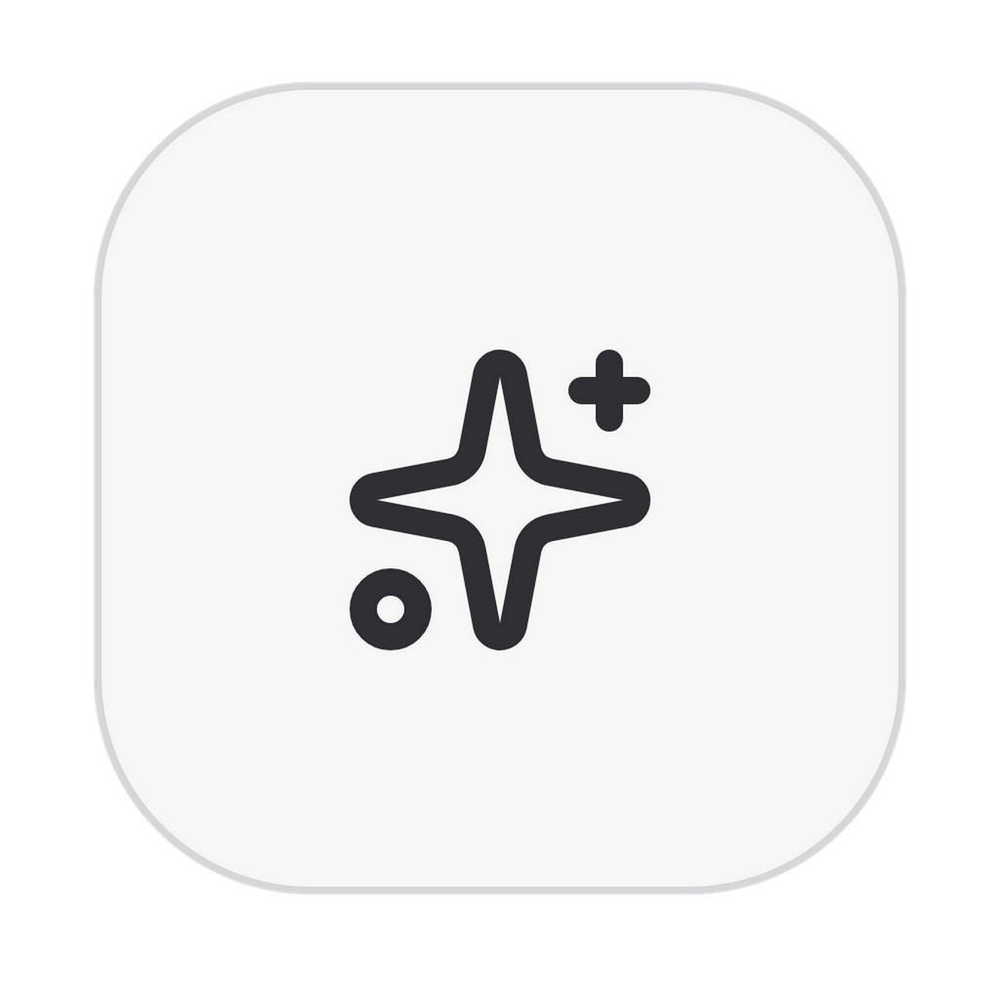
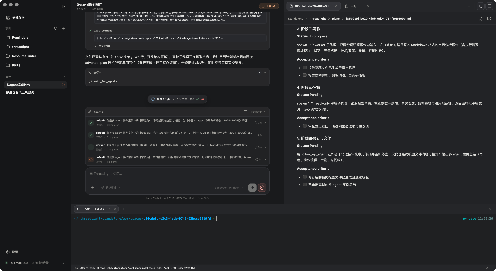

<p align="center">
  
</p>

<h1 align="center">Threadlight</h1>

<p align="center">开源的多 Agent 工程 Runtime：把规划、并行协作、工具执行、终端、文件、Diff 与交付放在同一条可观察、可恢复的任务时间线上。</p>

<p align="center">
  <a href="./README.en.md">English</a> ·
  <a href="https://threadlight.xyz">官方网站</a> ·
  <a href="./docs/SELF_HOSTING.zh-CN.md">完整自部署说明</a>
</p>

<p align="center">
  
</p>

## 快速开始

### 推荐：一键自部署 Host + Web

需要 Node.js 22+，支持 macOS 与 Linux：

```bash
curl -fsSL https://threadlight.xyz/install.sh | sh
```

脚本会下载 Host + Web、生成随机 Token，并注册 launchd 或 systemd 用户服务。Host 默认从空状态启动；打开脚本输出的地址、输入 Token，再在 UI 内添加项目。

```bash
~/.local/share/threadlight-self-host/bin/threadlight-self-host status
~/.local/share/threadlight-self-host/bin/threadlight-self-host logs
~/.local/share/threadlight-self-host/bin/threadlight-self-host show-token
```

默认只监听 `127.0.0.1:7432`。远程使用请通过 SSH 隧道、VPN 或 HTTPS 反向代理，不要把明文 HTTP 端口暴露到公网。

### macOS 桌面端

[下载 Apple Silicon 未签名测试版 DMG](https://github.com/nagisa77/threadlight/releases/download/v1.0.0/Threadlight-1.0.0-macOS-arm64-unsigned-test.dmg)

这是**未签名测试版**。安装后请在 Finder 中按住 Control 点击 Threadlight 并选择“打开”；如果仍被阻止，前往“系统设置 → 隐私与安全性 → 仍要打开”。

```text
SHA-256: 838f0a26e9f575cdb33e694b4fa923d865bde060581ab45104ae2f2266d74e0a
```

### Web 客户端

[打开 Threadlight Web](https://nagisa77.github.io/threadlight/)

Web 客户端不包含执行环境。你需要先自部署 Host，并让浏览器通过 HTTPS 域名访问 Host 端口，然后使用 Host 地址和 Token 连接。

## 能力

| 能力                   | Threadlight 提供什么                                                          |
| ---------------------- | ----------------------------------------------------------------------------- |
| 多 Agent 编排          | 根 Agent 可委派、追问、等待、重试和中断子 Agent，并在结束前收集结果。         |
| 受控 Plan 模式         | 先只读研究，再按验收标准逐步执行；没有完成证据时拒绝提前收尾。                |
| 全过程可观察           | Plan、模型输出、工具调用、命令日志、文件变化、来源和 token usage 保持可见。   |
| 工程工作区             | 对话、Git worktree、文件、Diff、终端、Review、Commit、Push 与 PR 共用上下文。 |
| Provider 中立          | Agent Loop 不依赖厂商 wire format；不同模型协议由独立 Adapter 接入。          |
| 本地与远程 Host        | 桌面端和 Web 使用同一协议，代码、模型、终端与数据可以留在目标机器。           |
| Skills、Plugins 与 MCP | 可发现、可组合，并随任务保存能力快照，避免恢复后上下文漂移。                  |
| 可恢复状态             | 对话、Agent 树和 opaque model state 跨工具轮次持久化，支持中断后继续。        |

内置工具以当前用户权限运行，不提供操作系统级 sandbox。请只使用可信工作区；需要强隔离时请配合容器或虚拟机。

Apache-2.0 · [源码](https://github.com/nagisa77/threadlight) · [参与贡献](./CONTRIBUTING.md)
