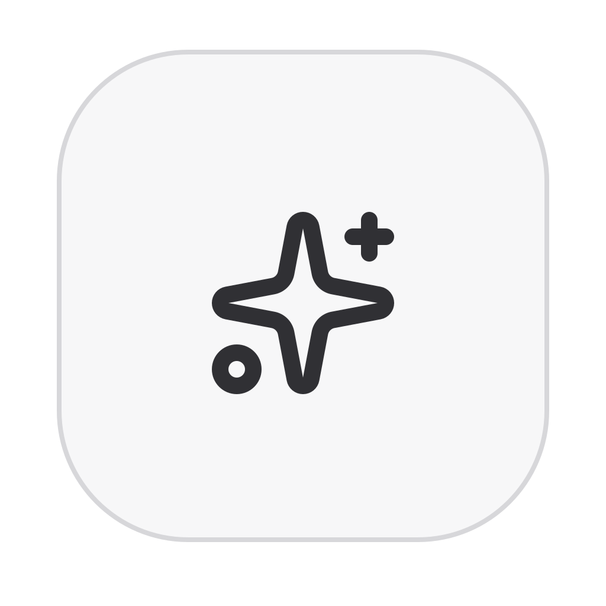
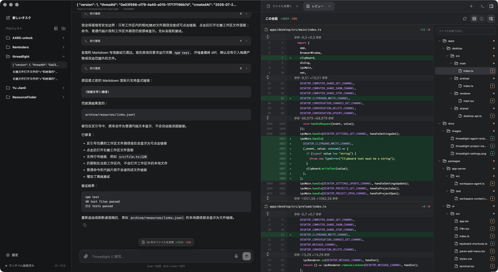
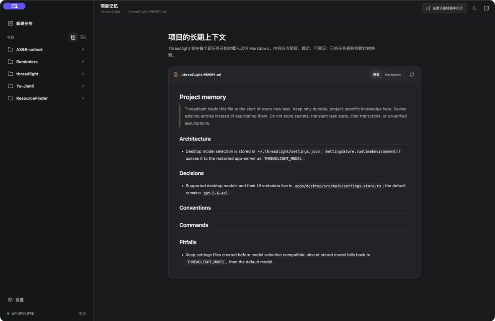
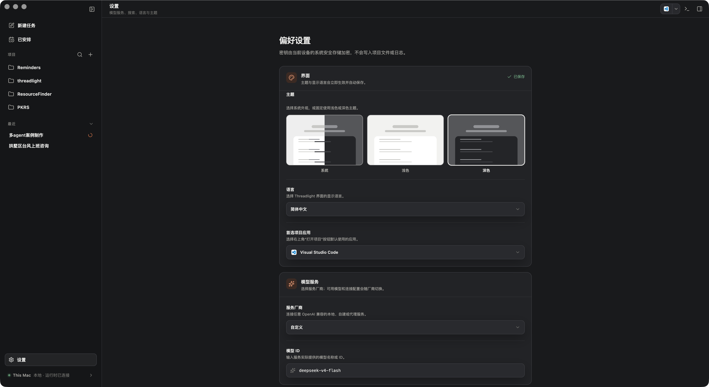
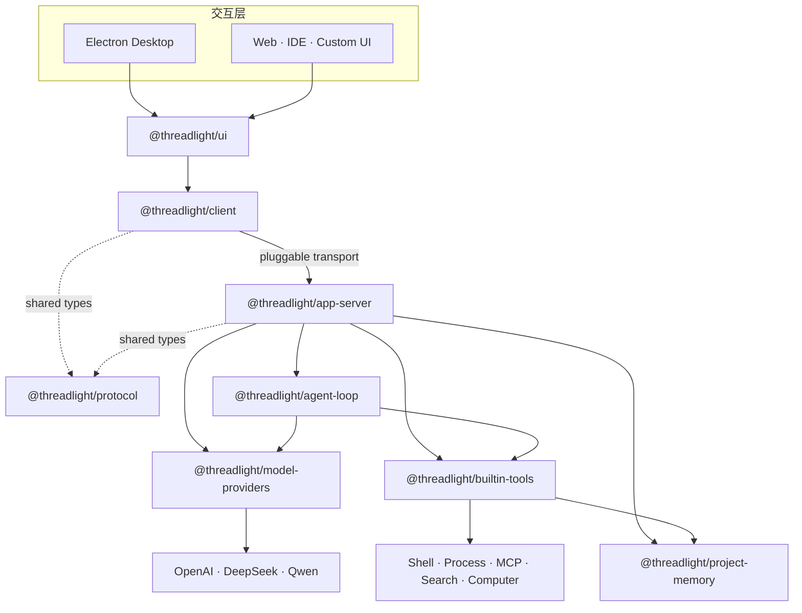

<div align="center">
  

  <h1>Threadlight</h1>

  <p><strong>让本地 Agent 的每一步，都清晰可见。</strong></p>
  <p>
    一个面向真实工程工作的开源 Agent Runtime 与桌面客户端。<br />
    将模型推理、工具调用、终端、代码审阅、项目记忆与 Computer Use<br />
    组织成一条可观察、可恢复、可扩展的执行链路。
  </p>

  <p>
    <a href="./README.md">简体中文</a>
    ·
    <a href="./README.en.md">English</a>
    ·
    <a href="./docs/DEVELOPMENT.zh-CN.md">开发文档</a>
  </p>

  <p>
    
    <a href="https://github.com/nagisa77/threadlight/releases/latest"></a>
    <a href="https://github.com/nagisa77/threadlight/actions/workflows/ci.yml"></a>
    
    
    
    
  </p>
</div>

<br />

<p align="center">
  
</p>

<p align="center">
  <sub>模型思考、工具执行、文件变更与 Diff 审阅，都在同一个工作空间里。</sub>
</p>

---

Threadlight 不只是一个聊天界面，也不把 Agent 简化成一次模型请求。

一个真实任务往往会经历多轮模型调用、流式输出、工具执行、后台进程、文件修改与中断恢复。Threadlight 把这些过程完整地呈现出来，同时在工具回合之间保留模型的 opaque state，让推理连续性和调用链路不因一次工具执行而丢失。

> [!IMPORTANT]
> Threadlight 目前处于 **Alpha** 阶段，适合本地开发、架构探索和 Agent 应用原型。内置工具以当前用户权限运行，不提供操作系统级 sandbox；请只在可信工作区中使用。

## 为什么是 Threadlight

| | 能力 | Threadlight 的实现 |
| --- | --- | --- |
| **01** | **执行过程可观察** | Thread、Turn、模型增量、工具调用、命令输出、文件变更与 token usage 都以结构化事件呈现。 |
| **02** | **真正面向本地工程** | 项目、任务、附件、终端、文件审阅与长期记忆围绕工作区组织，不依赖远端业务数据库。 |
| **03** | **Provider 中立** | 核心循环不依赖厂商 SDK；OpenAI Responses、DeepSeek 与千问兼容协议由独立 adapter 接入。 |
| **04** | **状态连续且可恢复** | 工具回合内保留 opaque model state；任务可以持久化、恢复、中断，并在写盘前进行尺寸限制与脱敏。 |
| **05** | **能力边界清晰** | Agent Loop、provider adapter、app-server、protocol、client 与 UI 各司其职，可单独复用和扩展。 |
| **06** | **离线可验证** | 新行为使用 scripted model provider 测试，无需真实 API 或网络即可复现多轮工具链路。 |

## 桌面端，不只是聊天框

### 在任务里直接审阅工作成果

执行记录与最终回答保持在主对话中，文件树、源码、会话变更和 Diff 可以在右侧面板并排打开；底部面板则可承载一个或多个终端或文件标签。任务上下文不需要在聊天、编辑器和终端之间来回搬运。

### 把项目知识留在项目里

<p align="center">
  
</p>

项目长期记忆保存在可读、可版本化的 `.threadlight/MEMORY.md` 中。每个新任务读取当时的上下文快照；Agent 通过带 revision 校验的 provider-neutral 工具更新它，避免并发写入静默覆盖。

### 在一个地方管理模型与体验

<p align="center">
  
</p>

桌面端支持：

- OpenAI、DeepSeek、阿里云百炼 · 千问之间切换。
- 针对不同任务选择默认模型。
- 简体中文、繁體中文、English、日本語与 한국어。
- 跟随系统、浅色与深色主题。
- 使用系统安全存储加密 API Key，不将密钥写入项目或日志。

### 更多内置体验

- 流式展示回答、执行进度、工具活动与命令输出。
- 支持图片和文件拖放、附件预览与语音转写输入。
- 会话级后台进程管理：查询、增量读取、等待与终止。
- 临时 MCP runtime：按任务连接 stdio 或 Streamable HTTP Server。
- macOS Computer Use：共享 App、窗口或显示器，并通过画中画预览 Agent 看到的稳定画布。
- 键盘快捷键、可调整面板、多标签终端与文件视图。

## 架构



四条边界贯穿整个项目：

1. **Loop 不感知厂商协议。** `agent-loop` 只依赖 `ModelProvider`；请求 wire format、附件上传和 opaque state 转换都留在 adapter。
2. **Server 不侵入执行核心。** `app-server` 负责 JSON-RPC、任务生命周期、持久化与 transport，不把这些职责下沉到 loop。
3. **Client 与 Server 只共享协议。** 两端通过 `@threadlight/protocol` 对齐类型，不形成实现层面的循环依赖。
4. **工具是能力边界。** 命令、进程、MCP、搜索、项目记忆与 Computer Use 实现统一的 `Tool` 接口，可按运行环境组合或替换。

## 快速开始

### 环境要求

- Node.js 22 或更高版本
- npm
- macOS：完整 Computer Use 需要屏幕录制与辅助功能权限

```bash
git clone https://github.com/nagisa77/threadlight.git
cd threadlight
npm install
npm test
```

### 启动桌面端

推荐直接在桌面端设置页填写模型服务、模型和搜索密钥：

```bash
npm run desktop:dev
```

也可以从环境变量注入配置：

```bash
export OPENAI_API_KEY="your-key"

# 可选：启用 web_search
export BRAVE_SEARCH_API_KEY="your-key"

npm run desktop:dev
```

构建并预览 production bundle：

```bash
npm run desktop:preview
```

| 服务 | 必需配置 | 可选配置 |
| --- | --- | --- |
| OpenAI | `OPENAI_API_KEY` | `THREADLIGHT_MODEL` |
| DeepSeek | `THREADLIGHT_PROVIDER=deepseek`、`DEEPSEEK_API_KEY` | `THREADLIGHT_MODEL` |
| 千问 | `THREADLIGHT_PROVIDER=qwen`、`DASHSCOPE_API_KEY` | `DASHSCOPE_BASE_URL`、`THREADLIGHT_MODEL` |

```bash
# DeepSeek
export THREADLIGHT_PROVIDER="deepseek"
export DEEPSEEK_API_KEY="your-key"
export THREADLIGHT_MODEL="deepseek-v4-pro"

# 或阿里云百炼 · 千问
export THREADLIGHT_PROVIDER="qwen"
export DASHSCOPE_API_KEY="your-key"
export DASHSCOPE_BASE_URL="https://dashscope.aliyuncs.com/compatible-mode/v1"
export THREADLIGHT_MODEL="qwen3.7-plus"
```

Electron renderer 保持浏览器环境且不启用 Node integration。Preload 只暴露受限的 Threadlight bridge，app-server 作为独立子进程运行。

## 作为 Runtime 使用

### Agent Loop

```ts
import { AgentLoop, defineAgent } from "@threadlight/agent-loop";
import { createExecCommandTool } from "@threadlight/builtin-tools";
import { OpenAIResponsesProvider } from "@threadlight/model-providers";

const loop = new AgentLoop(
  new OpenAIResponsesProvider({ defaultModel: "gpt-5.6-sol" }),
);

const result = await loop.run(
  defineAgent({
    name: "assistant",
    instructions: "Answer directly and use tools when needed.",
    tools: [createExecCommandTool({ workspaceRoot: process.cwd() })],
  }),
  "运行测试并总结结果",
  { onEvent: (event) => console.log(event) },
);

console.log(result.output);
```

### 类型安全客户端

```ts
import { ThreadlightClient } from "@threadlight/client";

const client = new ThreadlightClient(transport);
await client.initialize();

const { threadId } = await client.startThread();
client.on("turn/completed", ({ output }) => console.log(output));

await client.startTurn(threadId, "分析当前工作区");
```

客户端只要求 transport 能发送请求并订阅服务端消息。桌面端使用 JSONL/stdio，Web 或 IDE 可以实现 WebSocket 等其他 transport，上层调用保持不变。

## 内置能力

### 命令与后台进程

`exec_command` 直接在受约束的工作目录中执行命令。超过前台等待时间后，进程转入受管后台并返回 opaque `sessionId`：

- `process_status`：查看状态。
- `process_read`：增量读取输出。
- `process_wait`：等待结束或超时。
- `process_kill`：终止进程。

### MCP

每个会话拥有独立的临时 MCP runtime。Agent 可以连接用户明确提供、或工作区内可验证的 stdio / Streamable HTTP MCP Server，先读取工具 schema，再执行调用。连接只在当前 app-server 进程的对应会话中复用，删除会话或服务退出时自动释放。

### Computer Use

Electron 桌面端的 `computer_share` 可以：

- 选择一个或多个 App、窗口或显示器。
- 将目标组合成 1440 × 900 的稳定画布。
- 通过不抢焦点的置顶画中画同步展示 Agent 视野。
- 优先使用 macOS Accessibility action 定向输入。
- 在桌面或不支持定向输入的界面显式启用 system input 兼容模式。

首次使用需要授予屏幕录制和辅助功能权限。设置 `THREADLIGHT_COMPUTER_USE=0` 可以关闭该能力。

### 项目记忆

项目长期记忆存放在 `.threadlight/MEMORY.md`。Agent 使用 `project_memory` 工具先读后写，并携带 revision 更新。它适合保存稳定、可验证、跨任务仍然有效的项目事实、架构决定和约定，不应包含密钥、聊天转录、临时状态或未经验证的推测。

## 数据与安全

```text
~/.threadlight/
├── settings.json                 # 加密后的密钥与全局偏好
└── project-map.json              # 项目、路径与会话摘要索引

<project>/.threadlight/
├── MEMORY.md                     # 用户可读的长期项目记忆
└── conversations/
    └── <threadId>.json           # 会话与受限、脱敏的 opaque model state
```

- 密钥只从运行时环境或系统安全存储注入，不进入源码、fixtures、项目文件或日志。
- app-server 的协议输出与诊断日志分别写入 stdout 和 stderr。
- 持久化的 opaque model state 上限为 5 MiB；Computer Use 截图写盘前会替换为占位图。
- 附件通过受校验的本地路径引用，wire adapter 不直接内联文件字节。
- `.threadlight/` 默认应加入版本控制忽略规则。
- 内置工具不是系统 sandbox；需要强隔离时，请在容器、虚拟机或操作系统 sandbox 中运行。

## Monorepo

```text
threadlight/
├── apps/
│   └── desktop/              Electron 主进程、preload、renderer 与原生输入桥
├── packages/
│   ├── agent-loop/           Provider-neutral Agent 执行核心
│   ├── model-providers/      模型厂商 adapter
│   ├── project-memory/       原子 Markdown 存储与 revision 校验
│   ├── builtin-tools/        命令、进程、MCP、搜索、记忆与 Computer Use
│   ├── protocol/             JSON-RPC 请求、响应、通知与共享类型
│   ├── app-server/           Thread / Turn 编排、持久化与 transport
│   ├── client/               类型安全、transport-neutral 客户端
│   └── ui/                   可复用 React 会话界面
└── test/                     跨 package 集成测试
```

## 开发与验证

第一次贡献请从 **[完整开发指南](./docs/DEVELOPMENT.zh-CN.md)** 开始；其中包含架构调用链、package 边界、新增工具、新增模型 Provider、扩展协议、桌面端调试和离线测试示例。提交规范见 [CONTRIBUTING.md](./CONTRIBUTING.md)。

```bash
npm run build       # 构建所有 packages 与桌面端
npm run typecheck   # TypeScript 类型检查
npm test            # 完整离线测试
npm run clean       # 清理 TypeScript build artifacts
```

提交新行为时，请同时添加使用 scripted model provider 的离线测试，并遵守以下约束：

- `agent-loop` 必须保持 provider-neutral。
- 厂商 wire format 只能出现在 adapter 中。
- app-server 的 transport / protocol 职责不能进入 loop。
- 工具回合之间必须保留 opaque model state。
- 不得在源码、fixtures 或日志中写入 API Key 或其他密钥。

## 当前边界

- `exec_command` 会限制工作目录、前台等待时间和输出大小，但不是系统 sandbox。
- `web_search` 当前通过 Brave Search API 提供。
- stdio 已与核心协议解耦，可以继续扩展 WebSocket 等 transport。
- 当前优先面向本地单用户工程工作流，项目仍处于快速演进阶段。

---

<div align="center">
  <strong>Threadlight</strong>
  <br />
  <sub>让 Agent 的思考、行动与结果，在同一条时间线上发光。</sub>
</div>
