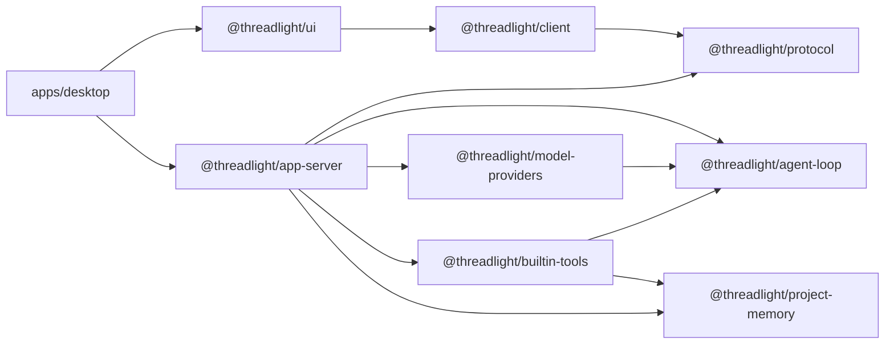

# Threadlight development guide

[English](./DEVELOPMENT.md) · [简体中文](./DEVELOPMENT.zh-CN.md)

This guide is for developers who want to understand, modify, or extend Threadlight. You do not need a model API key to build or test the project: the test suite uses scripted model providers and is offline by default.

> Threadlight is Alpha software. `0.x` releases may change internal APIs, persistence formats, and desktop interactions. Breaking changes are documented in the [changelog](../CHANGELOG.md).

## 1. Set up a development environment

### Requirements

- Node.js 22 or newer
- npm 10 or newer
- macOS 13 or newer for the desktop native-input bridge and full Computer Use
- Xcode Command Line Tools when building the macOS native-input bridge

```bash
git clone https://github.com/nagisa77/threadlight.git
cd threadlight
npm install
npm test
```

`npm test` builds the monorepo and runs the complete Vitest suite. It should not require secrets, a remote model, or an MCP server.

Start the desktop development environment:

```bash
npm run desktop:dev
```

For a faster package-only loop:

```bash
npm run build:packages
npx vitest run packages/agent-loop/test/agent-loop.test.ts
```

## 2. Commands

| Command | Purpose |
| --- | --- |
| `npm run desktop:dev` | Build packages and start Electron in development mode |
| `npm run desktop:package` | Create a standalone `.app` for the current Mac architecture |
| `npm run build:packages` | Build all packages with TypeScript project references |
| `npm run build` | Build packages, the native bridge, and the desktop production bundle |
| `npm run typecheck` | Type-check packages and the desktop app |
| `npm test` | Build and run the complete offline test suite |
| `npm run desktop:preview` | Preview the desktop production bundle |
| `npm run clean` | Remove TypeScript build artifacts |

Run one test file:

```bash
npx vitest run packages/app-server/test/app-server.test.ts
```

Filter by test name:

```bash
npx vitest run -t "preserves opaque state"
```

## 3. Repository map

```text
threadlight/
├── apps/
│   └── desktop/              Electron main, preload, renderer, and macOS native input
├── packages/
│   ├── agent-loop/           Provider-neutral model/tool execution loop
│   ├── model-providers/      OpenAI Responses and OpenAI-compatible adapters
│   ├── project-memory/       Long-term memory, revisions, and atomic writes
│   ├── builtin-tools/        Commands, processes, MCP, search, plans, memory, Computer Use
│   ├── protocol/             JSON-RPC methods, notifications, and shared data types
│   ├── app-server/           Task/turn lifecycle, persistence, and server transport
│   ├── client/               Type-safe, transport-neutral client
│   └── ui/                   Reusable React interface
├── test/                     Cross-package integration tests
└── docs/                     Development documentation and screenshots
```

Dependencies flow in one direction:



Preserve these boundaries:

1. `agent-loop` knows only provider-neutral `ModelProvider`, `Tool`, and data types.
2. Vendor request formats, response formats, streaming events, and attachment references stay in `model-providers`.
3. JSON-RPC, stdio, and task persistence belong to `app-server`, not the loop.
4. Client and server share types through `protocol`, not implementation dependencies.
5. Opaque model state passes unchanged between tool turns. Provider cleanup and size checks happen only before persistence.

## 4. How a turn runs

```mermaid
sequenceDiagram
    participant UI
    participant Client
    participant Server as AppServer
    participant Loop as AgentLoop
    participant Provider
    participant Tool

    UI->>Client: startTurn(threadId, input)
    Client->>Server: JSON-RPC turn/start
    Server-->>UI: turn/started
    Server->>Loop: run(agent, input, savedState)
    Loop->>Provider: generate(request)
    Provider-->>Loop: text + toolCalls + opaque state
    Loop-->>Server: structured AgentEvent
    Loop->>Tool: execute(arguments, context)
    Tool-->>Loop: result
    Loop->>Provider: generate(state + toolResults)
    Provider-->>Loop: final text + next state
    Loop-->>Server: RunResult
    Server->>Server: sanitize and persist
    Server-->>UI: turn/completed
```

Important details:

- `ModelTurn.state` is opaque. The loop carries it but never interprets or reconstructs it.
- Tool failures become `ToolResult.isError` values so the model can recover. They do not end the task unless the execution loop itself fails.
- `AgentEvent` drives UI observability. A new phase may also require protocol projection, persistence, and resume changes.
- Resumed tasks use persisted state and must respect the default 5 MiB limit and screenshot-redaction rules.

## 5. Common changes

### Add a built-in tool

A tool implements the `Tool` interface. Prefer a `createXxxTool(options)` factory so environment dependencies remain explicit.

```ts
import { defineTool } from "@threadlight/agent-loop";

export function createGreetingTool() {
  return defineTool({
    name: "greet",
    description: "Create a short greeting for a name.",
    parameters: {
      type: "object",
      properties: {
        name: { type: "string" },
      },
      required: ["name"],
      additionalProperties: false,
    },
    async execute(input, context) {
      context.signal.throwIfAborted();
      const { name } = input as { name: string };
      return { greeting: `Hello, ${name}!` };
    },
  });
}
```

A complete change normally:

1. Implements the tool under `packages/builtin-tools/src/`.
2. Exports its factory and public types from `packages/builtin-tools/src/index.ts`.
3. Injects the tool where the agent is composed; the loop must not import it.
4. Adds offline tests for success, invalid input, cancellation, and recovery paths.

Do not read undeclared global state, or put API keys in tool arguments, outputs, fixtures, or logs.

### Add a model provider

A provider implements `ModelProvider`:

```ts
import type {
  ModelProvider,
  ModelRequest,
  ModelTurn,
} from "@threadlight/agent-loop";

export class ExampleProvider implements ModelProvider {
  async generate(request: ModelRequest): Promise<ModelTurn> {
    // Translate the provider-neutral request into the vendor wire format here.
    return {
      text: "done",
      toolCalls: [],
      state: { providerOwned: "opaque" },
    };
  }
}
```

An adapter must:

- Translate `ModelRequest.tools` into the vendor's tool schema.
- Preserve stable tool-call IDs so later results link to the original calls.
- Support `AbortSignal` and incremental text events.
- Preserve all vendor-owned state required across tool turns.
- When state contains large or sensitive fields, implement `prepareStateForPersistence` on the configured provider and inject it into app-server's `ModelStatePersistence`; the loop does not own disk persistence policy.
- When supporting files, implement `validateAttachment` / `uploadAttachment` on the configured provider for app-server's attachment runtime; the loop only forwards provider-ready attachments supplied by a controller.
- Add configuration to `provider-factory.ts` without adding vendor branches to the loop.

Tests should inject a fake SDK client or scripted responses and assert the actual wire payload. Never call a live API from the test suite.

### Extend the JSON-RPC protocol

Protocol work begins in `packages/protocol/src/index.ts`:

1. Add a type to `ThreadlightMethodMap` or `ThreadlightNotificationMap`.
2. Update `THREADLIGHT_METHODS` so runtime validation matches the type map.
3. Handle the request in `app-server`, including success and error tests.
4. Add a type-safe convenience method to `ThreadlightClient`.
5. Update the desktop transport or UI consumer.
6. Add offline tests at the protocol, server, and client layers.

Keep transport details out of method payloads. The same protocol should run over JSONL/stdio, WebSocket, or an in-memory test transport.

### Change the desktop app or UI

- Electron main process: `apps/desktop/src/main/`
- Security bridge: `apps/desktop/src/preload/`
- Renderer entry: `apps/desktop/src/renderer/`
- Reusable UI: `packages/ui/src/`
- Global styles: `packages/ui/src/styles.css`

The renderer stays browser-like with Node integration disabled. Filesystem, terminal, secure storage, and Computer Use capabilities must pass through a narrow preload API or app-server.

For interaction changes, check:

- Empty, loading, streaming, failed, interrupted, and resumed states.
- Keyboard behavior, focus order, and visible focus.
- Light, dark, and system themes.
- Copy length in Chinese, English, Japanese, and Korean.
- Narrow windows, resized panels, and long-content scrolling.

## 6. Offline testing

Every new behavior needs a deterministic test without network access. The core pattern is a scripted provider:

```ts
import type {
  ModelProvider,
  ModelRequest,
  ModelTurn,
} from "@threadlight/agent-loop";

class ScriptedProvider implements ModelProvider {
  readonly requests: ModelRequest[] = [];

  constructor(private readonly turns: readonly ModelTurn[]) {}

  async generate(request: ModelRequest): Promise<ModelTurn> {
    this.requests.push(request);
    const turn = this.turns[this.requests.length - 1];
    if (!turn) throw new Error("Script exhausted");
    return turn;
  }
}
```

Use it to verify:

- The first model turn emits a tool call.
- The tool receives the correct arguments and `AbortSignal`.
- The next request contains both the original opaque state and the tool result.
- Event order, token usage, and final output are correct.
- Interrupts, tool errors, unknown tools, step limits, and resumed runs are stable.

Keep package tests beside their source package. Put cross-package behavior in the root `test/` directory.

## 7. Debugging

### app-server

```bash
npm run build:packages
npm start
```

app-server uses one JSON-RPC message per line over stdin/stdout. Protocol output must go to stdout and diagnostics to stderr; writing logs to stdout corrupts the transport.

### Electron

```bash
npm run desktop:dev
```

If the native-input bridge fails to build:

```bash
xcode-select -p
clang --version
```

Computer Use also requires macOS Screen Recording and Accessibility permissions. Unrelated package tests do not need these permissions.

### Reset incremental builds

If declarations or source maps appear stale:

```bash
npm run clean
npm run build:packages
```

## 8. Before opening a pull request

```bash
npm run typecheck
npm test
git diff --check
```

Confirm that:

- New behavior has a scripted-provider or equivalent offline test.
- No real API keys, tokens, user paths, or sensitive output were added.
- Provider, loop, server, and transport boundaries remain intact.
- Opaque state survives tool turns and task resume.
- New public APIs are exported from the package `index.ts` and documented.
- New UI copy exists in every supported locale.
- User-visible changes appear under `Unreleased` in `CHANGELOG.md`.

See [CONTRIBUTING.md](../CONTRIBUTING.md) for the contribution and pull-request workflow.
