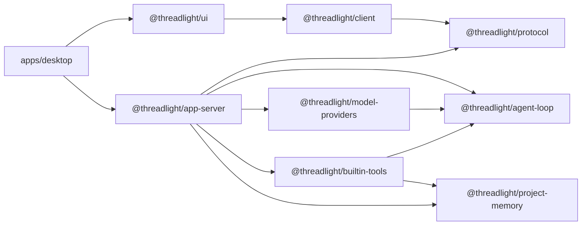

# Threadlight 开发指南

[简体中文](./DEVELOPMENT.zh-CN.md) · [English](./DEVELOPMENT.md)

这份文档面向准备阅读、修改或扩展 Threadlight 的开发者。你不需要模型 API Key 就能完成构建和测试；测试套件使用脚本化模型 provider，默认不访问网络。

> Threadlight 1.x 遵循语义化版本。公共 API、持久化格式或桌面端交互发生不兼容变化时，会记录在 [CHANGELOG](../CHANGELOG.md) 中。

## 1. 五分钟完成本地开发环境

### 前置要求

- Node.js 22 或更高版本
- npm 10 或更高版本
- macOS 13 或更高版本（仅桌面端原生输入和完整 Computer Use 需要）
- Xcode Command Line Tools（仅构建 macOS 原生输入桥需要）

```bash
git clone https://github.com/nagisa77/threadlight.git
cd threadlight
npm install
npm test
```

`npm test` 会先构建整个 monorepo，再运行全部 Vitest 测试。正常情况下不需要任何密钥、远程模型或 MCP Server。

启动桌面端开发环境：

```bash
npm run desktop:dev
```

如果你只修改 TypeScript package，可以使用更快的循环：

```bash
npm run build:packages
npx vitest run packages/agent-loop/test/agent-loop.test.ts
```

## 2. 常用命令

| 命令 | 用途 |
| --- | --- |
| `npm run desktop:dev` | 构建 packages，并以开发模式启动 Electron |
| `npm run desktop:package` | 生成当前 Mac 架构的独立 `.app` |
| `npm run build:packages` | 使用 TypeScript project references 构建全部 packages |
| `npm run build` | 构建 packages、原生输入桥和桌面端 production bundle |
| `npm run typecheck` | 检查 packages 与桌面端类型 |
| `npm test` | 完整构建并运行全部离线测试 |
| `npm run desktop:preview` | 预览桌面端 production bundle |
| `npm run clean` | 清理 TypeScript 构建产物 |

运行单个测试文件：

```bash
npx vitest run packages/app-server/test/app-server.test.ts
```

按测试名过滤：

```bash
npx vitest run -t "preserves opaque state"
```

## 3. 仓库结构

```text
threadlight/
├── apps/
│   └── desktop/              Electron main、preload、renderer 与 macOS 原生输入桥
├── packages/
│   ├── agent-loop/           Provider-neutral 的模型/工具执行循环
│   ├── model-providers/      OpenAI Responses 与 OpenAI-compatible adapters
│   ├── project-memory/       项目长期记忆、revision 与原子写入
│   ├── builtin-tools/        命令、进程、MCP、搜索、计划、记忆与 Computer Use
│   ├── protocol/             JSON-RPC 方法、通知和共享数据类型
│   ├── app-server/           Task/turn 生命周期、持久化和 server transport
│   ├── client/               类型安全、transport-neutral 的客户端
│   └── ui/                   可复用 React 界面
├── test/                     跨 package 集成测试
└── docs/                     开发文档和截图
```

依赖方向是单向的：



请保持以下边界：

1. `agent-loop` 只认识 `ModelProvider`、`Tool` 和 provider-neutral 数据结构。
2. 厂商请求格式、响应格式、流式事件和附件引用只存在于 `model-providers` adapter。
3. JSON-RPC、stdio 和 task 持久化属于 `app-server`，不能进入 loop。
4. `client` 和 server 通过 `protocol` 共享类型，不互相依赖实现。
5. 工具回合之间必须原样保留 opaque model state；落盘前才进行 provider 清理和尺寸校验。

## 4. 一次任务如何执行

```mermaid
sequenceDiagram
    participant UI
    participant Client
    participant Server as AppServer
    participant Loop as AgentLoop
    participant Provider
    participant Tool

    UI->>Client: startTurn(threadId, input)
    Client->>Server: JSON-RPC turn/start
    Server-->>UI: turn/started
    Server->>Loop: run(agent, input, savedState)
    Loop->>Provider: generate(request)
    Provider-->>Loop: text + toolCalls + opaque state
    Loop-->>Server: structured AgentEvent
    Loop->>Tool: execute(arguments, context)
    Tool-->>Loop: result
    Loop->>Provider: generate(state + toolResults)
    Provider-->>Loop: final text + next state
    Loop-->>Server: RunResult
    Server->>Server: sanitize and persist
    Server-->>UI: turn/completed
```

需要特别注意：

- `ModelTurn.state` 是 opaque value。loop 可以携带它，但不能解释或重建它。
- 工具失败会作为 `ToolResult.isError` 返回模型，让模型有机会恢复；除非执行循环本身失败，否则不应直接结束 task。
- `AgentEvent` 是 UI 可观察性的来源。新增阶段时，需要同步考虑 protocol 投影、持久化和恢复。
- task 恢复必须使用已持久化的 state，并遵守默认 5 MiB 上限和截图脱敏规则。

## 5. 修改不同模块

### 新增内置工具

工具实现 `Tool` 接口。建议暴露一个 `createXxxTool(options)` 工厂，避免把运行环境硬编码在工具中。

```ts
import { defineTool } from "@threadlight/agent-loop";

export function createGreetingTool() {
  return defineTool({
    name: "greet",
    description: "Create a short greeting for a name.",
    parameters: {
      type: "object",
      properties: {
        name: { type: "string" },
      },
      required: ["name"],
      additionalProperties: false,
    },
    async execute(input, context) {
      context.signal.throwIfAborted();
      const { name } = input as { name: string };
      return { greeting: `Hello, ${name}!` };
    },
  });
}
```

完整改动通常包括：

1. 在 `packages/builtin-tools/src/` 中实现工具。
2. 从 `packages/builtin-tools/src/index.ts` 导出工厂和公开类型。
3. 在组合 agent 的位置注入工具，而不是让 loop 直接 import。
4. 添加成功、参数错误、取消和恢复路径的离线测试。

不要让工具读取未声明的全局状态，也不要把 API Key 写入参数、输出、fixture 或日志。

### 新增模型 Provider

Provider 实现 `ModelProvider`：

```ts
import type {
  ModelProvider,
  ModelRequest,
  ModelTurn,
} from "@threadlight/agent-loop";

export class ExampleProvider implements ModelProvider {
  async generate(request: ModelRequest): Promise<ModelTurn> {
    // 在这里把 provider-neutral request 转换为厂商 wire format。
    return {
      text: "done",
      toolCalls: [],
      state: { providerOwned: "opaque" },
    };
  }
}
```

实现时必须覆盖：

- 把 `ModelRequest.tools` 转换为厂商工具 schema。
- 稳定映射 tool call ID；后续 tool result 必须仍能关联原调用。
- 支持 `AbortSignal` 和增量文本事件。
- 在多轮工具调用中保留厂商需要的全部 state。
- 如 state 含大体积或敏感字段，在配置后的 provider 上实现 `prepareStateForPersistence`，并将它注入 app-server 的 `ModelStatePersistence`；loop 不参与落盘策略。
- 如支持附件，在配置后的 provider 上实现 `validateAttachment` / `uploadAttachment`，由 app-server 的附件 runtime 调用；loop 只转发 controller 提供的 provider-ready attachment。
- 在 `provider-factory.ts` 中加入配置入口，但不要把厂商分支加到 loop。

测试应使用伪造的 SDK client 或脚本响应，断言实际 wire payload；不要调用真实 API。

### 扩展 JSON-RPC 协议

协议变化从 `packages/protocol/src/index.ts` 开始：

1. 在 `ThreadlightMethodMap` 或 `ThreadlightNotificationMap` 中加入类型。
2. 更新 `THREADLIGHT_METHODS`，使运行时校验与类型保持一致。
3. 在 `app-server` 实现请求处理，并测试成功和错误响应。
4. 在 `ThreadlightClient` 添加类型安全的便利方法。
5. 更新 desktop transport 或 UI 消费逻辑。
6. 添加协议、server、client 三层离线测试。

不要把 transport 细节放进 method payload。相同协议应当可以运行在 JSONL/stdio、WebSocket 或测试内存 transport 上。

### 修改桌面端或 UI

- Electron 主进程：`apps/desktop/src/main/`
- 安全桥：`apps/desktop/src/preload/`
- renderer 入口：`apps/desktop/src/renderer/`
- 可复用界面：`packages/ui/src/`
- 全局样式：`packages/ui/src/styles.css`

Renderer 保持浏览器环境，Node integration 关闭。文件系统、终端、安全存储和 Computer Use 只能通过受限 preload API 或 app-server 暴露。

交互修改至少检查：

- 空状态、加载、流式输出、失败、中断和恢复。
- 键盘操作、焦点顺序和可见焦点。
- 浅色、深色和跟随系统主题。
- 简中、繁中、英文、日文和韩文下的文案长度。
- 窄窗口、面板 resize 和长内容滚动。

## 6. 离线测试策略

每个新行为都需要一个无需网络的确定性测试。最重要的模式是脚本化 provider：

```ts
import type {
  ModelProvider,
  ModelRequest,
  ModelTurn,
} from "@threadlight/agent-loop";

class ScriptedProvider implements ModelProvider {
  readonly requests: ModelRequest[] = [];

  constructor(private readonly turns: readonly ModelTurn[]) {}

  async generate(request: ModelRequest): Promise<ModelTurn> {
    this.requests.push(request);
    const turn = this.turns[this.requests.length - 1];
    if (!turn) throw new Error("Script exhausted");
    return turn;
  }
}
```

使用它验证：

- 第一轮模型返回 tool call。
- 工具收到正确参数和 `AbortSignal`。
- 下一轮 request 同时包含原 opaque state 与 tool result。
- 事件顺序、token usage 和最终输出正确。
- 中断、工具错误、未知工具、最大步数和恢复路径行为稳定。

测试文件与源码 package 对齐放置；跨 package 行为放在仓库根目录 `test/`。

## 7. 调试

### app-server

```bash
npm run build:packages
npm start
```

app-server 在 stdin/stdout 上使用一行一个 JSON-RPC message 的 JSONL。协议输出只能写 stdout；诊断信息只能写 stderr，否则会破坏 transport。

### Electron

```bash
npm run desktop:dev
```

如果原生输入桥构建失败，先确认：

```bash
xcode-select -p
clang --version
```

Computer Use 还需要 macOS 的屏幕录制和辅助功能权限。与该能力无关的 package 测试不需要这些权限。

### 清理增量构建

遇到看似过期的声明文件或 source map：

```bash
npm run clean
npm run build:packages
```

## 8. 提交前检查

```bash
npm run typecheck
npm test
git diff --check
```

提交前确认：

- 新行为有脚本化 provider 或等价的离线测试。
- 没有真实 API Key、token、用户路径或敏感输出。
- 没有破坏 provider / loop / server / transport 边界。
- opaque state 在工具回合和 task 恢复中保持连续。
- 新公开 API 已从 package `index.ts` 导出，并有文档或示例。
- UI 文案已加入所有支持的 locale。
- 用户可见变化已加入 `CHANGELOG.md` 的 `Unreleased` 部分。

贡献流程、分支和 PR 要求见 [CONTRIBUTING.md](../CONTRIBUTING.md)。
